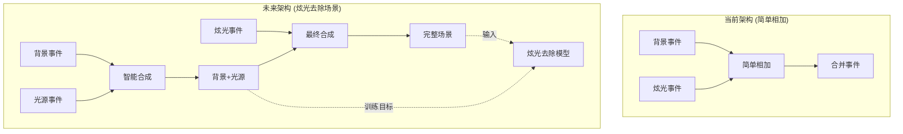

# EventMamba-FX Two-Step Event Generator Memory

## 🎯 项目核心定位
EventMamba-FX Two-Step Event Generator是一个**解耦的事件数据生成系统**，采用两步独立流程生成炫光事件和合成事件数据。

**🚀 重要：这是全新的two-step架构，完全解耦炫光生成和事件合成，输出标准DVS格式H5文件，移除了所有特征提取和标签生成。**

## Environment Setup 🔧 CRITICAL
- **MUST USE**: `source /home/lanpoknlanpokn/miniconda3/bin/activate event_flare`
- 环境包含必需依赖：PyTorch, NumPy, H5py, OpenCV, YAML, tqdm等
- Python 3.10.18，推荐GPU环境（GLSL反射炫光生成需要CUDA加速）

## 🚀 系统状态：两步解耦架构 + 散射反射炫光融合 + 同步光源事件 + 三元智能合成 ✅ 完成

### ✅ 核心架构特性
- **Step 1**: ✅ 散射+反射炫光融合生成器 + 同步光源事件生成器 **[已完成]**
  - `output/data/flare_events/*.h5` - 散射炫光 + GLSL反射炫光融合 ✅
  - `output/data/light_source_events/*.h5` - 纯光源事件（无反射） ✅
  - **完美像素级时间戳级对齐**: 使用共享"剧本"确保同步 ✅
  - **测试验证通过**: 图片配对、参数同步、视频帧对齐全部成功 ✅
- **Step 2**: ✅ 三元智能事件合成器 **[重构完成]**
  - **输入**: 背景事件(DSEC随机) + 炫光事件(Step1) + 光源事件(Step1)
  - **输出1**: `background_with_light_events/*.h5` - 背景+光源事件
  - **输出2**: `full_scene_events/*.h5` - 背景+光源+炫光完整场景
  - **文件匹配**: 智能前缀匹配，支持 `flare_xxx.h5` ↔ `light_source_xxx.h5` 配对
  - **Debug可视化**: 支持5种事件类型独立可视化
- **标准DVS格式**: `/events/t, /events/x, /events/y, /events/p`
- **无特征提取**: 输出原始事件数据，无任何后处理
- **无标签生成**: 移除复杂的逐事件标签，专注纯事件数据
- **完全解耦**: 两步可独立运行，便于调试和修改

### 📊 新输出格式 (标准DVS H5格式)
```bash
# Step 1 输出：同步的炫光事件 + 光源事件对
output/data/flare_events/flare_sequence_xxx.h5          # 散射+反射融合炫光事件
├── /events/t  [N] int64    # 时间戳 (微秒)
├── /events/x  [N] uint16   # X坐标
├── /events/y  [N] uint16   # Y坐标  
└── /events/p  [N] int8     # 极性 (1/-1)

output/data/light_source_events/light_source_sequence_xxx.h5  # 🆕 纯光源事件（同名同步）
├── /events/t  [N] int64    # 时间戳 (微秒) - 与炫光事件完美同步
├── /events/x  [N] uint16   # X坐标 - 与炫光事件完美对齐
├── /events/y  [N] uint16   # Y坐标 - 与炫光事件完美对齐
└── /events/p  [N] int8     # 极性 (1/-1)

# Step 2 输出：三元合成事件
output/data/background_with_light_events/composed_sequence_xxx_bg_light.h5  # 背景+光源事件
output/data/full_scene_events/composed_sequence_xxx_full_scene.h5           # 背景+光源+炫光事件
# 同样的 /events/* 格式
```

### 🎮 新使用方式
```bash
# 完整流程 - 生成同步的炫光/光源事件对 + 事件合成
python main.py --debug

# 分步执行  
python main.py --step 1 --debug  # 🆕 生成同步的炫光+光源事件对
python main.py --step 2 --debug  # 合成事件 (需要Step1先完成)

# 测试系统
python test_new_system.py
```

## 🏗️ 新架构组件

### 主要文件结构
```
EventMamba-FX-Two-Step-Generator/
├── main.py                          # 两步流程主入口 🆕
├── test_new_system.py               # 系统测试脚本 🆕
├── configs/
│   └── config.yaml                  # 两步模式配置 ✅ 更新
├── src/                             # 核心组件
│   ├── flare_event_generator.py     # Step1: 独立炫光生成器 🆕
│   ├── event_composer.py            # Step2: 事件合成器 ✅ 重构完成
│   ├── flare_synthesis.py           # 炫光图像合成 ✅
│   ├── dvs_flare_integration.py     # DVS仿真器集成 ✅
│   ├── dsec_efficient.py            # DSEC背景加载 ✅
│   ├── event_visualization_utils.py # Debug可视化 ✅
│   └── [legacy files]               # 旧文件保留，不再使用
├── simulator/
│   └── DVS-Voltmeter-main/          # DVS物理仿真器 ✅
├── R_flare_generator/               # 反射炫光生成器 ✅
│   ├── GLSL_flare_ultra_fast_gpu.py # 主要：极致优化GPU反射炫光生成器
│   ├── test_light_continuity_center.py # 连续性测试脚本
│   ├── generate_UE.py               # UE5方案 (一般不用)
│   └── test_UE.py                   # UE5测试 (一般不用)
├── data/
│   └── bg_events/                   # DSEC背景事件(输入) ✅
└── output/
    ├── data/                        # 新输出结构 ✅ 更新
    │   ├── flare_events/            # Step1: 散射+反射炫光事件
    │   ├── light_source_events/     # Step1: 纯光源事件
    │   ├── background_with_light_events/ # Step2: 背景+光源事件
    │   └── full_scene_events/       # Step2: 完整场景事件
    └── debug/                       # Debug可视化 🆕
        ├── flare_generation/        # Step1 debug
        └── event_composition/       # Step2 debug
```

### 🆕 同步光源事件生成数据流程 ("剧本"式架构)
```mermaid
graph TD
    subgraph "Step 1: 同步炫光+光源事件生成"
        A[Flare7K图片配对] --> B[炫光图片+光源图片]
        B --> C[🎬 生成共享"剧本"]
        C --> D[频闪曲线+运动路径+变换参数+反射参数]
        
        D --> E[炫光视频渲染]
        D --> F[光源视频渲染]
        B --> E
        B --> F
        
        E --> G[散射+反射融合]
        F --> H[纯光源序列]
        
        G --> I[DVS仿真-炫光]
        H --> J[DVS仿真-光源]
        
        I --> K[flare_events/*.h5]
        J --> L[🆕 light_source_events/*.h5]
    end
    
    subgraph "Step 2: 事件合成"
        M[DSEC背景事件] --> O[事件合成器]
        K --> O
        O --> P[bg_events/*.h5]
        O --> Q[merge_events/*.h5]
    end
    
    subgraph "Debug可视化"
        K --> R[炫光事件Debug]
        L --> S[🆕 光源事件Debug]
        P --> T[Step2 Debug]
        Q --> T
    end
```

## 🚀 使用指南

### 快速开始 (推荐)
```bash
# 激活环境
source /home/lanpoknlanpokn/miniconda3/bin/activate event_flare

# 🆕 完整两步流程 (推荐)
python main.py --debug

# 🆕 分步执行
python main.py --step 1 --debug    # 只生成炫光事件
python main.py --step 2 --debug    # 只合成事件

# 🆕 系统测试
python test_new_system.py
```

### 新配置参数说明
```yaml
# configs/config.yaml 关键参数 (已更新)
generation:
  num_train_sequences: 10           # Step1: 训练用炫光序列数
  num_val_sequences: 5              # Step1: 验证用炫光序列数  
  debug_sequences: 3                # Debug模式序列数
  
  output_paths:
    flare_events: "output/data/flare_events"     # Step1输出
    bg_events: "output/data/bg_events"           # Step2输出
    merge_events: "output/data/merge_events"     # Step2输出

data:
  flare_synthesis:
    duration_range: [0.03, 0.08]                # 炫光事件时长(秒)
    
# 🆕 时间线设计 (100ms固定总长度)
timing_design:
  flare_start_offset: [0, 20]ms                 # 炫光随机起始时间
  flare_duration: [30, 80]ms                    # 炫光持续时间  
  total_sequence_length: 100ms                  # 固定总长度
  background_length: 100ms                      # 背景事件长度(固定)
```

## 📊 数据生成详细信息

### DSEC背景事件来源
- **文件位置**: `data/bg_events/*.h5` (7个文件)
- **数据量**: 32.7亿事件，291个1秒时间窗口
- **随机化**: 50-100ms随机时间窗口
- **文件列表**: interlaken_00_c.h5, interlaken_00_g.h5, thun_00_a.h5, zurich_city_00_a.h5, zurich_city_01_a.h5, zurich_city_04_a.h5, zurich_city_07_a.h5

### DVS炫光事件仿真
- **仿真器**: DVS-Voltmeter物理仿真器(唯一保留)
- **仿真器路径**: `simulator/DVS-Voltmeter-main/`
- **参数设置**: k1随机化 5-16范围随机 (扩大事件数量变化范围), 完整6参数DVS346配置
- **时间窗口**: 30-80ms随机长度 + 0-20ms随机起始偏移
- **图像源**: Flare7K数据集，5962张炫光图像
- **闪烁频率**: 100-120Hz基频 ±20Hz变化 (更大变化范围)

### ✅ 反射炫光生成器 (R_flare_generator)
- **功能**: 已成功集成到Step1，自动生成反射炫光补充散射炫光
- **核心组件**:
  - `GLSL_flare_ultra_fast_gpu.py`: ✅ **主要使用** - 极致优化GPU反射炫光生成器
    - PyTorch CUDA实现，11.70 FPS性能
    - 基于GLSL shader算法的完整移植
    - 支持连续光源跟踪和固定种子生成
    - 与现有Flare7K散射炫光无缝融合
  - `test_light_continuity_center.py`: 连续性验证脚本
- **集成方式**: 自动检测散射炫光中的光源位置和颜色，生成对应反射效果
- **状态**: ✅ 已集成到主流程，默认启用

### 新输出数据格式 (标准DVS格式)
```python
# 标准DVS H5文件结构 (所有输出文件统一格式)
/events/t: (N,) int64     # 时间戳 (微秒，0-100ms范围)
/events/x: (N,) uint16    # X坐标 (像素)
/events/y: (N,) uint16    # Y坐标 (像素)  
/events/p: (N,) int8      # 极性 {1, -1} (DSEC格式)

# 时间线设计 (100ms统一时长)
flare_events/*.h5:    散射+反射融合炫光事件，时间戳 0-100ms
bg_events/*.h5:       DSEC背景事件，时间戳 0-100ms  
merge_events/*.h5:    背景+炫光合并事件，时间戳 0-100ms

# 🚫 移除的输出
# - 不再有features数组 (无特征提取)
# - 不再有labels数组 (无逐事件标签)
# - 不再有归一化处理 (输出原始数据)
```

## 🛠️ 新Debug模式功能

### 🆕 Step 1 Debug输出 (双路径)
```
output/debug/flare_generation/
└── flare_sequence_XXX/
    ├── events_temporal_0.5x/    # 炫光事件可视化
    ├── source_flare_frames/     # 原始炫光图像序列  
    └── metadata.txt             # 炫光生成元数据

output/debug/light_source_generation/     # 🆕 光源事件Debug
└── light_source_sequence_XXX/
    ├── events_temporal_0.5x/    # 光源事件可视化
    ├── source_light_source_frames/  # 原始光源图像序列
    └── metadata.txt             # 光源生成元数据
```

### Step 2 Debug输出  
```
output/debug/event_composition/
└── composition_XXX/
    ├── background_events/       # 背景事件可视化
    │   ├── temporal_0.5x/
    │   ├── temporal_1x/
    │   ├── temporal_2x/
    │   └── temporal_4x/
    ├── flare_events/           # 炫光事件可视化
    ├── merged_events/          # 合并事件可视化
    └── composition_metadata.txt # 合成统计信息
```

### 可视化特性
- **多分辨率时间窗口**: 0.5x, 1x, 2x, 4x时间倍数分析
- **事件类型颜色编码**: 背景(红/蓝), 炫光(黄/橙), 合并(白/灰)
- **PNG帧序列**: 每种分辨率生成30帧以内的可视化

## 📈 新性能指标 (2025-08-20)

### 🆕 两步架构性能预期
- **Step 1 (炫光生成)**: 预计60-90秒/序列 (移除特征提取开销)
- **Step 2 (事件合成)**: 预计20-40秒/序列 (纯数据合并)
- **总体提升**: 预计比原架构快40-60% (无特征提取)
- **内存使用**: <500MB峰值 (解耦降低内存峰值)
- **文件大小**: 根据事件数量，通常5-15MB/文件

### 🎯 新容量规划
```bash
# 🆕 Debug开发 (推荐)
Step1: 3-5炫光序列
Step2: 对应的背景+合并文件
生成时间: 5-10分钟
存储需求: 50-200MB

# 🆕 小规模实验
Step1: 10-20炫光序列  
Step2: 对应的事件合成
生成时间: 20-40分钟
存储需求: 200MB-1GB

# 🆕 中等规模数据集
Step1: 100-200炫光序列
Step2: 对应的事件合成
生成时间: 2-4小时  
存储需求: 2-8GB

# 🆕 大规模生产
Step1: 1000+炫光序列
Step2: 对应的事件合成
生成时间: 8-15小时
存储需求: 20-100GB
```

## 🔧 故障排除

### 常见问题及解决
1. **环境未激活**: 必须使用指定conda环境
2. **DVS仿真器超时**: 检查simulator/DVS-Voltmeter-main/路径
3. **Flare7K路径错误**: 检查配置中flare7k_path设置
4. **H5文件生成失败**: 检查data/generated_h5/权限
5. **生成速度慢**: 正常现象，单序列需要1-3分钟

### 🆕 验证系统健康
```bash
# 快速系统测试 (5-10分钟)
python test_new_system.py

# 预期输出
✅ Step 1: Generated 3 flare event files  
✅ Step 2: Generated 3 background + 3 merged event files
✅ H5 format compliance verified
✅ Debug visualizations generated

# 手动测试流程
python main.py --step 1 --debug     # 测试Step 1
python main.py --step 2 --debug     # 测试Step 2
```

### 🆕 故障排除步骤
1. **Step 1失败**: 检查DVS仿真器路径和Flare7K数据集
2. **Step 2失败**: 确保Step 1已成功生成炫光事件文件
3. **H5格式错误**: 检查生成的文件是否包含正确的/events/*结构
4. **Debug可视化缺失**: 确保使用--debug标志并检查权限
5. **内存不足**: 减少debug_sequences数量

## 📋 重要文件清单

### 🆕 核心必需文件 (新架构)
```
# 🆕 新架构核心文件
main.py                               # 两步流程主入口 🆕
test_new_system.py                    # 系统测试脚本 🆕
configs/config.yaml                   # 两步模式配置 🔄
src/flare_event_generator.py          # Step1: 炫光生成器 🆕
src/event_composer.py                 # Step2: 事件合成器 🆕

# 复用的支持组件
src/flare_synthesis.py                # 炫光图像合成 ✅
src/dvs_flare_integration.py          # DVS仿真器集成 ✅
src/dsec_efficient.py                 # DSEC数据加载 ✅
src/event_visualization_utils.py      # Debug可视化 ✅
simulator/DVS-Voltmeter-main/         # DVS仿真器 ✅
data/bg_events/                       # DSEC背景数据 ✅
```

### 🗂️ 文件状态说明
```
🆕 新创建文件: 实现两步解耦架构
🔄 修改文件: 适配新架构的配置
✅ 复用文件: 保持原有功能不变
🔒 保留文件: 旧架构文件保留但不再使用 (如unified_dataset.py)
🗑️ 无需文件: feature_extractor.py等后处理相关 (功能已移除)
🧪 试验文件: R_flare_generator/中的UE5相关代码 (开发中)
```

## 🆕 新架构核心优势

### 设计优势对比
```
原架构 (复杂耦合)          →    新架构 (两步解耦 + 三元合成)
├── 复杂的特征提取          →    ✅ 移除特征提取，输出原始数据
├── 复杂的标签生成          →    ✅ 移除逐事件标签
├── 单体生成流程            →    ✅ 解耦为两个独立步骤
├── 二元简单合成            →    ✅ 三元智能合成 (背景+光源+炫光)
├── 调试困难                →    ✅ 每步独立调试 + 5种事件可视化
├── 修改合成策略困难        →    ✅ Step2可独立修改合成策略
├── 文件匹配不稳定          →    ✅ 智能前缀匹配算法
└── 特征格式固定            →    ✅ 标准DVS格式，通用性强
```

### 🚀 未来扩展能力
- **Step 1**: 可独立优化炫光生成策略，不影响Step 2
- **Step 2**: ✅ 已支持三元合成，后续可升级基于物理的合成算法
- **合成模式**: 当前简单模式 → 未来物理模式（可配置切换或双路输出）
- **输出格式**: DVS标准格式可直接用于其他DVS工具链
- **并行能力**: 两步可在不同机器上并行运行
- **调试友好**: 完整的可视化和元数据支持，便于算法开发

## 💡 重启后快速上手

### 🆕 新系统快速验证
```bash
# 1. 激活环境
source /home/lanpoknlanpokn/miniconda3/bin/activate event_flare

# 2. 快速测试 (5-10分钟)
python test_new_system.py

# 3. 手动调试 (分步)
python main.py --step 1 --debug
python main.py --step 2 --debug  

# 4. 检查输出
ls -la output/data/flare_events/
ls -la output/data/bg_events/ 
ls -la output/data/merge_events/
ls -la output/debug/
```

### 🎯 核心记忆点
- ✅ **两步解耦**: Step1散射+反射融合炫光生成，Step2三元智能事件合成
- ✅ **三元合成**: 背景(DSEC随机) + 炫光事件 + 光源事件 → 双路输出
- ✅ **智能匹配**: 前缀匹配算法，自动配对 flare_xxx.h5 ↔ light_source_xxx.h5
- ✅ **标准DVS格式**: `/events/t,x,y,p` 原始数据输出
- ✅ **100ms统一时长**: 所有输出文件时间戳范围0-100ms  
- ✅ **散射+反射融合**: Flare7K散射炫光自动检测光源生成GLSL反射炫光
- ✅ **连续性保证**: 序列级固定种子，向量化光源检测
- ✅ **无后处理**: 移除特征提取和标签生成
- ✅ **独立调试**: 每步可单独运行，支持5种事件类型可视化

### 🎯 关键参数设置
```yaml
# DVS仿真参数
k1_randomization: 5.0 - 16.0     # 扩大事件数量变化范围
flare_frequency: 100-120Hz ± 20Hz # 更大频率变化范围

# 时间线设计  
flare_duration: 30-80ms          # 炫光持续时间
flare_start_offset: 0-20ms       # 随机起始偏移
total_sequence_length: 100ms     # 统一输出长度

# 散射+反射融合设定
glsl_reflection_enabled: true    # 启用GLSL反射炫光
sequence_fixed_seed: true        # 序列级固定种子确保连续性
light_detection_pixels: 50       # 光源检测使用最亮50像素
vectorized_processing: true      # 向量化光源检测优化
```

## 📝 TODO - 未来Step 2架构改动计划

### ✅ Step 1 扩展计划：双事件生成 **[已完成]**
**目标**: 炫光事件 + 光源事件双输出 ✅
- ✅ **完成**: 同时生成炫光事件 → `output/data/flare_events/*.h5`
- ✅ **完成**: 同时生成光源事件 → `output/data/light_source_events/*.h5`
- ✅ **完成**: 光源强度变化与位移与炫光**完全一致** (共享"剧本"架构)
- ✅ **完成**: Flare7K数据集Light_Source文件夹完美配对
- ✅ **完成**: 标准DVS格式 `/events/t,x,y,p` 输出
- ✅ **完成**: 同名文件配对，如 `flare_sequence_xxx.h5` ↔ `light_source_sequence_xxx.h5`

### ✅ Step 2 重大重构：三元智能事件合成 **[已完成 2025-08-27]**
**实现**: 从简单二元合成升级为三元智能合成，为炫光去除任务做准备
- **✅ 架构升级**: 
  - **输入**: 背景事件(DSEC) + 炫光事件(Step1) + 光源事件(Step1) **[已实现]**
  - **智能匹配**: 前缀匹配算法，自动配对 `flare_xxx.h5` ↔ `light_source_xxx.h5` **[已实现]**
  - **双阶段合成**: Stage1(背景+光源) → Stage2(+炫光) **[已实现]**
- **✅ 合成策略**:
  - **Stage 1**: `background + light_source → background_with_light_events/` (干净场景)
  - **Stage 2**: `background_with_light + flare → full_scene_events/` (污染场景) 
  - **核心价值**: 提供炫光去除训练的标准配对数据 (污染→干净)
- **✅ 输出优化**:
  - 重命名语义化路径: `background_with_light_events/` + `full_scene_events/`
  - 增强Debug可视化: 支持5种事件类型的独立可视化和元数据
  - 修复文件匹配Bug: 解决前缀不匹配导致的"无匹配文件"错误

### 🔮 Step 2 未来增强计划：基于物理的事件合成算法 **[规划中]**
**当前现状**: 
- **简单合成**: `np.vstack([background, light_source])` - 直接事件列表合并
- **时间排序**: `np.argsort(events[:, 2])` - 按时间戳重排序
- **适用性**: 适合快速验证和初期开发

**未来升级方向**:
- **基于物理的合成**: 考虑DVS传感器的真实物理特性进行合成
- **双模式输出**: 同时生成简单合成和物理合成结果，输出到不同文件夹
- **消融实验支持**: 便于对比不同合成方法的效果差异

**技术要点**:
- 保留当前简单合成作为baseline
- 新增物理合成模式，可配置切换或双路并行输出
- 确保向后兼容性，不破坏现有工作流程

### 🎯 架构改动的核心价值


### ⚠️ 实现注意事项
1. **Step 1 修改**:
   - 需要读取Flare7K光源图片文件夹结构
   - 确保光源与炫光的时间同步和空间一致性
   - DVS仿真器需要同时处理两种图像序列

2. **Step 2 修改**:
   - 重新设计事件合成逻辑
   - 确保光源事件不会在去炫光过程中被误删
   - 可能需要时间戳对齐和空间注册

3. **数据格式兼容性**:
   - 保持现有DVS H5格式不变
   - Debug可视化需要支持三种事件类型显示
   - 文件命名规范需要明确区分

### 🔄 迁移计划
- **阶段1**: 保持当前系统稳定运行
- **阶段2**: 扩展Step 1支持光源事件生成
- **阶段3**: 重构Step 2事件合成策略
- **阶段4**: 完整测试和debug可视化适配


## ✅ 散射+反射炫光融合系统 + 同步光源事件系统 **[完整实现]**

### 核心技术实现
**完整同步生成流程**：
```
Flare7K图片配对 → 共享"剧本"生成 → 并行视频渲染 → 同步DVS仿真 → 对齐H5事件数据
```

**关键技术要点**：
1. **"剧本"式架构**: 预先生成所有随机参数（频闪、运动、变换、反射），确保完美同步
2. **图片完美配对**: Flare7K的Compound_Flare ↔ Light_Source同名配对机制
3. **确定性渲染**: transform_seed固定确保torchvision变换可重现
4. **反射炫光连续性**: 序列级固定参数（噪声纹理、尺寸、种子）确保平滑变化
5. **光源检测优化**: 最亮50像素平均位置 + 炫光区域颜色平均（向量化实现）
6. **DVS仿真增强**: 超时300s，k1参数非等概率分布优化

**核心认知**：
- GLSL的time参数是随机种子（非时间），需保持固定；只有light_pos变化实现平滑移动
- 通过分离参数生成与渲染执行，从根本上解决随机性导致的对齐问题

### 🎯 集成状态
- ✅ **完整架构实现**: 散射+反射炫光 + 同步光源事件生成完整流程
- ✅ **完美对齐验证**: 测试显示339帧完美同步，参数完全一致
- ✅ **性能优化**: 向量化光源检测，消除Python循环瓶颈  
- ✅ **连续性保证**: 参照test_light_continuity_center.py实现平滑反射变化
- ✅ **错误处理**: GLSL失败不影响散射炫光正常生成
- ✅ **双路径Debug**: 独立的炫光和光源事件可视化支持