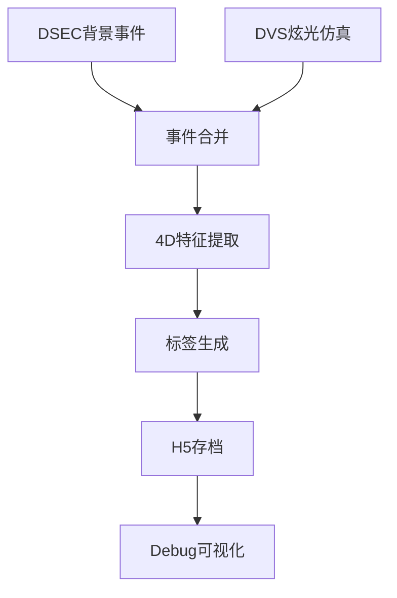

# EventMamba-FX Data Generator Memory

## 🎯 项目核心定位
EventMamba-FX Data Generator是一个**专用仿真数据生成器**，用于生成包含事件相机背景事件和合成炫光事件的训练数据集。

**⚠️ 重要：这是pure_simulation分支，已完全精简为纯数据生成工具，移除了所有训练/推理/评估功能。**

## Environment Setup 🔧 CRITICAL
- **MUST USE**: `source /home/lanpoknlanpokn/miniconda3/bin/activate event_flare`
- 环境包含必需依赖：PyTorch, NumPy, H5py, OpenCV, YAML, tqdm等
- Python 3.10.18，无需GPU（数据生成为CPU密集型）

## 🚀 系统状态：纯数据生成模式 (2025-08-12 验证通过)

### ✅ 成功验证的功能
- **数据生成**: 完全正常工作，已验证生成H5文件
- **Debug可视化**: 多分辨率事件可视化完全正常
- **DVS仿真**: DVS-Voltmeter物理仿真器集成正常
- **特征提取**: 4D快速特征提取工作正常
- **文件存档**: H5防重名机制和自动存档正常

### 📊 最新验证结果 (2025-08-12 13:33)
```bash
# 成功生成的数据文件
data/generated_h5/train/sequence_1754976690196_00000.h5  # 23MB, 966,977事件
data/generated_h5/val/sequence_1754976791625_00000.h5    # 12MB, 515,144事件

# 数据格式验证
Train: features(966977, 4) float32 + labels(966977,) int64
Val:   features(515144, 4) float32 + labels(515144,) int64

# 生成性能
Training: 1序列 = 2分40秒 (160.42s/序列)
Validation: 1序列 = 1分41秒 (101.05s/序列)
```

## 🏗️ 核心架构组件

### 主要文件结构
```
EventMamba-FX-Generator/
├── main.py                          # 数据生成主入口 ✅
├── configs/
│   ├── config.yaml                  # 主配置文件 ✅
│   └── config_generator.yaml        # 专用生成器配置 ✅
├── src/                             # 核心生成代码
│   ├── unified_dataset.py           # 统一数据集(generate模式) ✅
│   ├── epoch_iteration_dataset.py   # 生成后端(被unified调用) ✅
│   ├── flare_synthesis.py           # 炫光合成器 ✅
│   ├── dvs_flare_integration.py     # DVS仿真器集成 ✅
│   ├── feature_extractor.py         # 4D特征提取器 ✅
│   ├── dsec_efficient.py            # DSEC数据加载 ✅
│   ├── h5_data_utils.py             # H5文件处理 ✅
│   └── event_visualization_utils.py # 事件可视化(debug) ✅
├── simulator/
│   └── DVS-Voltmeter-main/          # DVS物理仿真器 ✅
├── data/
│   ├── bg_events/                   # DSEC背景事件(输入) ✅
│   └── generated_h5/                # 生成的H5数据(输出) ✅
└── output/
    └── debug_epoch_*/               # Debug可视化输出 ✅
```

### 数据生成流程


## 🚀 使用指南

### 快速开始 (推荐)
```bash
# 激活环境
source /home/lanpoknlanpokn/miniconda3/bin/activate event_flare

# Debug模式生成 (推荐开发用)
python main.py --config configs/config.yaml --debug

# 正常模式生成
python main.py --config configs/config.yaml
```

### 配置参数说明
```yaml
# configs/config.yaml 关键参数
data_pipeline:
  mode: 'generate'                    # 固定为生成模式

generation:
  num_train_sequences: 1              # debug模式调整为1
  num_val_sequences: 50               # debug模式调整为4
  
training:  # 这个配置段仍被epoch_iteration_dataset.py使用
  num_long_sequences_per_epoch: 1     # debug模式: 训练序列数
  
evaluation: # 这个配置段仍被epoch_iteration_dataset.py使用  
  num_long_sequences_per_epoch: 50    # debug模式: 验证序列数
```

## 📊 数据生成详细信息

### DSEC背景事件来源
- **文件位置**: `data/bg_events/*.h5` (7个文件)
- **数据量**: 32.7亿事件，291个1秒时间窗口
- **随机化**: 50-100ms随机时间窗口
- **文件列表**: interlaken_00_c.h5, interlaken_00_g.h5, thun_00_a.h5, zurich_city_00_a.h5, zurich_city_01_a.h5, zurich_city_04_a.h5, zurich_city_07_a.h5

### DVS炫光事件仿真
- **仿真器**: DVS-Voltmeter物理仿真器(唯一保留)
- **仿真器路径**: `simulator/DVS-Voltmeter-main/`
- **参数设置**: k1=2.5(降低敏感度), 完整6参数DVS346配置
- **时间窗口**: 30-80ms随机长度
- **图像源**: Flare7K数据集，5962张炫光图像

### 输出数据格式
```python
# H5文件结构
features: (N, 4) float32  # [x_norm, y_norm, dt, polarity]
labels: (N,) int64        # 0=背景事件, 1=炫光事件

# 特征说明
x_norm, y_norm: 归一化空间坐标 [0,1]
dt: 归一化时间差 [0,1]
polarity: 事件极性 {0, 1}
```

## 🛠️ Debug模式功能

### 可视化输出
使用`--debug`标志时，系统生成：
```
output/debug_epoch_000/
├── background_events/       # 背景事件可视化
├── flare_events/           # 炫光事件可视化  
├── merged_events/          # 合并事件可视化
├── flare_sequence_frames/  # 炫光序列帧
└── epoch_metadata.txt      # 统计信息
```

### 多分辨率分析
```
output/debug/epoch_iteration_analysis/
└── multi_resolution_sample_0/
    ├── dsec_background/    # 0.5x, 1x, 2x, 4x分辨率
    ├── dvs_flare/         # 多分辨率炫光分析
    └── merged_total/      # 合并事件分析
```

## 📈 性能指标

### 验证通过的性能 (2025-08-12)
- **训练序列生成**: 160.42秒/序列 (966,977事件)
- **验证序列生成**: 101.05秒/序列 (515,144事件)
- **内存使用**: <1GB峰值
- **文件大小**: ~23MB/训练序列, ~12MB/验证序列
- **特征提取**: <20ms (4D快速特征)

### 容量规划
```bash
# 小规模验证 (推荐开发)
训练: 1-10序列, 验证: 5-20序列
生成时间: 10-30分钟
存储需求: 100MB-1GB

# 中等规模训练
训练: 50-100序列, 验证: 20-50序列  
生成时间: 2-5小时
存储需求: 1-5GB

# 大规模生产
训练: 500-1000序列, 验证: 100-200序列
生成时间: 10-20小时
存储需求: 10-50GB
```

## 🔧 故障排除

### 常见问题及解决
1. **环境未激活**: 必须使用指定conda环境
2. **DVS仿真器超时**: 检查simulator/DVS-Voltmeter-main/路径
3. **Flare7K路径错误**: 检查配置中flare7k_path设置
4. **H5文件生成失败**: 检查data/generated_h5/权限
5. **生成速度慢**: 正常现象，单序列需要1-3分钟

### 验证系统健康
```bash
# 快速健康检查 (2分钟)
python main.py --config configs/config.yaml --debug

# 预期输出
✅ 找到7个背景事件文件
✅ 加载5962张炫光图像
✅ DVS仿真器初始化成功
✅ tqdm进度条正常推进
✅ 生成H5文件和debug可视化
```

## 📋 重要文件清单

### 核心必需文件 (禁止删除)
```
main.py                               # 主入口
configs/config.yaml                   # 主配置
src/unified_dataset.py                # 数据集核心
src/epoch_iteration_dataset.py        # 生成后端
src/flare_synthesis.py                # 炫光合成
src/dvs_flare_integration.py          # DVS集成
src/feature_extractor.py              # 特征提取
src/dsec_efficient.py                 # DSEC加载
src/h5_data_utils.py                  # H5工具
src/event_visualization_utils.py      # 可视化
simulator/DVS-Voltmeter-main/         # 仿真器目录
data/bg_events/                       # 背景数据
```

### 已移除的组件
```
❌ src/trainer.py, src/model.py       # 训练相关
❌ inference.py, src/predictor.py     # 推理相关  
❌ src/evaluate.py                     # 评估相关
❌ simulator/IEBCS-main/              # 额外仿真器
❌ simulator/V2CE-Toolbox-master/     # 额外仿真器
❌ checkpoints/ (3GB+)                # 模型权重
❌ reports/ (20个md文件)              # 分析报告
❌ src/utils/, tools/                 # 工具脚本
```

## 🔄 配置兼容性说明

### 当前配置结构
尽管已精简为纯生成器，但保持了与原始配置的兼容性：
- `training.num_long_sequences_per_epoch`: 控制训练序列数
- `evaluation.num_long_sequences_per_epoch`: 控制验证序列数
- `data_pipeline.mode`: 固定为'generate'
- debug模式会自动调整序列数量为小批量

## 💡 下次使用提示

### 重启后快速上手步骤
1. **激活环境**: `source /home/lanpoknlanpokn/miniconda3/bin/activate event_flare`
2. **验证系统**: `python main.py --config configs/config.yaml --debug`
3. **观察输出**: 确认看到进度条和"找到7个背景事件文件"
4. **等待完成**: debug模式约2-4分钟完成1个训练+1个验证序列
5. **检查结果**: `ls -la data/generated_h5/train/ data/generated_h5/val/`

### 核心记忆点
- ✅ **系统状态**: 纯数据生成器，已验证正常工作
- ✅ **生成性能**: 2-3分钟/序列，文件大小10-25MB
- ✅ **关键路径**: DSEC(7文件) + Flare7K(5962图像) + DVS仿真器
- ✅ **输出格式**: H5文件包含4D特征和二元标签
- ✅ **Debug功能**: 完整的多分辨率事件可视化

---

*最后验证: 2025-08-12 13:33 - 数据生成器功能完全正常，已生成验证数据*