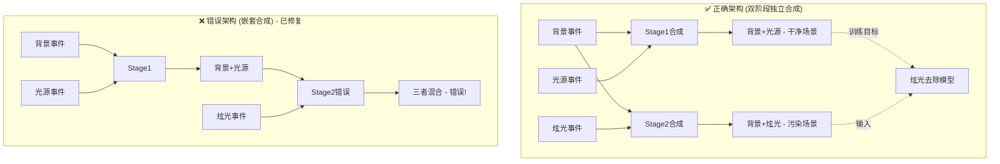

# EventMamba-FX Two-Step Event Generator Memory

## 🎯 项目核心定位
EventMamba-FX Two-Step Event Generator是一个**解耦的事件数据生成系统**，采用两步独立流程生成炫光事件和合成事件数据。

**🚀 重要：这是全新的two-step架构，完全解耦炫光生成和事件合成，输出标准DVS格式H5文件，移除了所有特征提取和标签生成。**

## Environment Setup 🔧 CRITICAL
- **MUST USE**: `source /home/lanpoknlanpokn/miniconda3/bin/activate event_flare`
- 环境包含必需依赖：PyTorch, NumPy, H5py, OpenCV, YAML, tqdm等
- Python 3.10.18，推荐GPU环境（GLSL反射炫光生成需要CUDA加速）

## 🚀 系统状态：两步解耦架构 + 散射反射炫光融合 + 同步光源事件 + 三元智能合成 ✅ 完成

### ✅ 核心架构特性
- **Step 1**: ✅ 散射+反射炫光融合生成器 + 同步光源事件生成器 **[已完成]**
  - `output/data/flare_events/*.h5` - 散射炫光 + GLSL反射炫光融合 ✅
  - `output/data/light_source_events/*.h5` - 纯光源事件（无反射） ✅
  - **完美像素级时间戳级对齐**: 使用共享"剧本"确保同步 ✅
  - **测试验证通过**: 图片配对、参数同步、视频帧对齐全部成功 ✅
- **Step 2**: ✅ 三元智能事件合成器 **[重构完成]**
  - **输入**: 背景事件(DSEC随机) + 炫光事件(Step1) + 光源事件(Step1)
  - **输出1**: `background_with_light_events/*.h5` - 背景+光源事件
  - **输出2**: `full_scene_events/*.h5` - 背景+光源+炫光完整场景
  - **文件匹配**: 智能前缀匹配，支持 `flare_xxx.h5` ↔ `light_source_xxx.h5` 配对
  - **Debug可视化**: 支持5种事件类型独立可视化
- **标准DVS格式**: `/events/t, /events/x, /events/y, /events/p`
- **无特征提取**: 输出原始事件数据，无任何后处理
- **无标签生成**: 移除复杂的逐事件标签，专注纯事件数据
- **完全解耦**: 两步可独立运行，便于调试和修改

### 📊 新输出格式 (标准DVS H5格式)
```bash
# Step 1 输出：同步的炫光事件 + 光源事件对
output/data/flare_events/flare_sequence_xxx.h5          # 散射+反射融合炫光事件
├── /events/t  [N] int64    # 时间戳 (微秒)
├── /events/x  [N] uint16   # X坐标
├── /events/y  [N] uint16   # Y坐标  
└── /events/p  [N] int8     # 极性 (1/-1)

output/data/light_source_events/light_source_sequence_xxx.h5  # 🆕 纯光源事件（同名同步）
├── /events/t  [N] int64    # 时间戳 (微秒) - 与炫光事件完美同步
├── /events/x  [N] uint16   # X坐标 - 与炫光事件完美对齐
├── /events/y  [N] uint16   # Y坐标 - 与炫光事件完美对齐
└── /events/p  [N] int8     # 极性 (1/-1)

# Step 2 输出：双阶段独立合成事件
output/data/background_with_light_events/composed_sequence_xxx_bg_light.h5  # 背景+光源事件 (干净场景)
output/data/background_with_flare_events/composed_sequence_xxx_bg_flare.h5  # 背景+炫光事件 (污染场景)
# 同样的 /events/* 格式
```

### 🎮 新使用方式
```bash
# 完整流程 - 生成同步的炫光/光源事件对 + 事件合成
python main.py --debug

# 分步执行  
python main.py --step 1 --debug  # 🆕 生成同步的炫光+光源事件对
python main.py --step 2 --debug  # 合成事件 (需要Step1先完成)

# 测试系统
python test_new_system.py
```

## 🏗️ 新架构组件

### 主要文件结构
```
EventMamba-FX-Two-Step-Generator/
├── main.py                          # 两步流程主入口 🆕
├── test_new_system.py               # 系统测试脚本 🆕
├── configs/
│   └── config.yaml                  # 两步模式配置 ✅ 更新
├── src/                             # 核心组件
│   ├── flare_event_generator.py     # Step1: 独立炫光生成器 🆕
│   ├── event_composer.py            # Step2: 事件合成器 ✅ 重构完成
│   ├── flare_synthesis.py           # 炫光图像合成 ✅
│   ├── dvs_flare_integration.py     # DVS仿真器集成 ✅
│   ├── dsec_efficient.py            # DSEC背景加载 ✅
│   ├── event_visualization_utils.py # Debug可视化 ✅
│   └── [legacy files]               # 旧文件保留，不再使用
├── simulator/
│   └── DVS-Voltmeter-main/          # DVS物理仿真器 ✅
├── R_flare_generator/               # 反射炫光生成器 ✅
│   ├── GLSL_flare_ultra_fast_gpu.py # 主要：极致优化GPU反射炫光生成器
│   ├── test_light_continuity_center.py # 连续性测试脚本
│   ├── generate_UE.py               # UE5方案 (一般不用)
│   └── test_UE.py                   # UE5测试 (一般不用)
├── data/
│   └── bg_events/                   # DSEC背景事件(输入) ✅
└── output/
    ├── data/                        # 新输出结构 ✅ 更新
    │   ├── flare_events/            # Step1: 散射+反射炫光事件
    │   ├── light_source_events/     # Step1: 纯光源事件
    │   ├── background_with_light_events/ # Step2: 背景+光源事件
    │   └── full_scene_events/       # Step2: 完整场景事件
    └── debug/                       # Debug可视化 🆕
        ├── flare_generation/        # Step1 debug
        └── event_composition/       # Step2 debug
```

### 🆕 同步光源事件生成数据流程 ("剧本"式架构)
```mermaid
graph TD
    subgraph "Step 1: 同步炫光+光源事件生成"
        A[Flare7K图片配对] --> B[炫光图片+光源图片]
        B --> C[🎬 生成共享"剧本"]
        C --> D[频闪曲线+运动路径+变换参数+反射参数]
        
        D --> E[炫光视频渲染]
        D --> F[光源视频渲染]
        B --> E
        B --> F
        
        E --> G[散射+反射融合]
        F --> H[纯光源序列]
        
        G --> I[DVS仿真-炫光]
        H --> J[DVS仿真-光源]
        
        I --> K[flare_events/*.h5]
        J --> L[🆕 light_source_events/*.h5]
    end
    
    subgraph "Step 2: 事件合成"
        M[DSEC背景事件] --> O[事件合成器]
        K --> O
        O --> P[bg_events/*.h5]
        O --> Q[merge_events/*.h5]
    end
    
    subgraph "Debug可视化"
        K --> R[炫光事件Debug]
        L --> S[🆕 光源事件Debug]
        P --> T[Step2 Debug]
        Q --> T
    end
```

## 🚀 使用指南

### 快速开始 (推荐)
```bash
# 激活环境
source /home/lanpoknlanpokn/miniconda3/bin/activate event_flare

# ✅ 完整两步流程 (推荐)
python main.py --debug

# ✅ 分步执行
python main.py --step 1 --debug    # 只生成炫光事件
python main.py --step 2 --debug    # 只合成事件

# ✅ 系统测试 (可选)
python test_new_system.py
```

### 新配置参数说明
```yaml
# configs/config.yaml 关键参数 (已更新)
generation:
  num_train_sequences: 10           # Step1: 训练用炫光序列数
  num_val_sequences: 5              # Step1: 验证用炫光序列数  
  debug_sequences: 3                # Debug模式序列数
  
  output_paths:
    flare_events: "output/data/flare_events"     # Step1输出
    bg_events: "output/data/bg_events"           # Step2输出
    merge_events: "output/data/merge_events"     # Step2输出

data:
  flare_synthesis:
    duration_range: [0.03, 0.08]                # 炫光事件时长(秒)
    
# 🆕 时间线设计 (100ms固定总长度)
timing_design:
  flare_start_offset: [0, 20]ms                 # 炫光随机起始时间
  flare_duration: [30, 80]ms                    # 炫光持续时间  
  total_sequence_length: 100ms                  # 固定总长度
  background_length: 100ms                      # 背景事件长度(固定)
```

## 📊 数据生成详细信息

### DSEC背景事件来源
- **文件位置**: `data/bg_events/*.h5` (7个文件)
- **数据量**: 32.7亿事件，291个1秒时间窗口
- **随机化**: 50-100ms随机时间窗口
- **文件列表**: interlaken_00_c.h5, interlaken_00_g.h5, thun_00_a.h5, zurich_city_00_a.h5, zurich_city_01_a.h5, zurich_city_04_a.h5, zurich_city_07_a.h5

### DVS炫光事件仿真
- **仿真器**: DVS-Voltmeter物理仿真器(唯一保留)
- **仿真器路径**: `simulator/DVS-Voltmeter-main/`
- **参数设置**: k1随机化 5-16范围随机 (扩大事件数量变化范围), 完整6参数DVS346配置
- **时间窗口**: 30-80ms随机长度 + 0-20ms随机起始偏移
- **图像源**: Flare7K数据集，5962张炫光图像
- **闪烁频率**: 100-120Hz基频 ±20Hz变化 (更大变化范围)

### ✅ 反射炫光生成器 (R_flare_generator)
- **功能**: 已成功集成到Step1，自动生成反射炫光补充散射炫光
- **核心组件**:
  - `GLSL_flare_ultra_fast_gpu.py`: ✅ **主要使用** - 极致优化GPU反射炫光生成器
    - PyTorch CUDA实现，11.70 FPS性能
    - 基于GLSL shader算法的完整移植
    - 支持连续光源跟踪和固定种子生成
    - 与现有Flare7K散射炫光无缝融合
  - `test_light_continuity_center.py`: 连续性验证脚本
- **集成方式**: 自动检测散射炫光中的光源位置和颜色，生成对应反射效果
- **状态**: ✅ 已集成到主流程，默认启用

### 新输出数据格式 (标准DVS格式)
```python
# 标准DVS H5文件结构 (所有输出文件统一格式)
/events/t: (N,) int64     # 时间戳 (微秒，0-100ms范围)
/events/x: (N,) uint16    # X坐标 (像素)
/events/y: (N,) uint16    # Y坐标 (像素)  
/events/p: (N,) int8      # 极性 {1, -1} (DSEC格式)

# 时间线设计 (100ms统一时长)
flare_events/*.h5:    散射+反射融合炫光事件，时间戳 0-100ms
bg_events/*.h5:       DSEC背景事件，时间戳 0-100ms  
merge_events/*.h5:    背景+炫光合并事件，时间戳 0-100ms

# 🚫 移除的输出
# - 不再有features数组 (无特征提取)
# - 不再有labels数组 (无逐事件标签)
# - 不再有归一化处理 (输出原始数据)
```

## 🛠️ 新Debug模式功能

### 🆕 Step 1 Debug输出 (双路径)
```
output/debug/flare_generation/
└── flare_sequence_XXX/
    ├── events_temporal_0.5x/    # 炫光事件可视化
    ├── source_flare_frames/     # 原始炫光图像序列  
    └── metadata.txt             # 炫光生成元数据

output/debug/light_source_generation/     # 🆕 光源事件Debug
└── light_source_sequence_XXX/
    ├── events_temporal_0.5x/    # 光源事件可视化
    ├── source_light_source_frames/  # 原始光源图像序列
    └── metadata.txt             # 光源生成元数据
```

### ✅ Step 2 完整Debug输出 **[2025-08-28 增强]**
```
output/debug/event_composition/
└── composition_XXX/
    # 🆕 双方法四阶段完整可视化
    ├── simple_stage1_bg_light_events/     # Simple方法 Stage1: BG+Light
    │   ├── temporal_0.5x/ ... temporal_4x/
    │   └── metadata.txt
    ├── simple_stage2_bg_flare_events/     # Simple方法 Stage2: BG+Flare  
    │   ├── temporal_0.5x/ ... temporal_4x/
    │   └── metadata.txt
    ├── physics_stage1_bg_light_events/    # Physics方法 Stage1: BG+Light
    │   ├── temporal_0.5x/ ... temporal_4x/
    │   └── metadata.txt
    ├── physics_stage2_bg_flare_events/    # Physics方法 Stage2: BG+Flare
    │   ├── temporal_0.5x/ ... temporal_4x/
    │   └── metadata.txt
    # Physics方法专用权重图
    ├── weight_map_stage1_bg_light.png     # Stage1权重图A(x,y)可视化
    ├── weight_map_stage2_full_scene.png   # Stage2权重图A(x,y)可视化
    ├── weight_heatmap_stage1_bg_light.png # OpenCV热力图版本
    ├── weight_heatmap_stage2_full_scene.png
    ├── weight_stats_stage1_bg_light.txt   # 权重图统计信息
    └── weight_stats_stage2_full_scene.txt
```

### ✅ 可视化特性 **[2025-08-28 标准化]**
- **多分辨率时间窗口**: 0.5x, 1x, 2x, 4x时间倍数分析
- **✅ 统一极性配色**: ON事件=红色, OFF事件=蓝色 (所有可视化统一标准)
- **PNG帧序列**: 每种分辨率生成30帧以内的可视化
- **🆕 方法对比**: 同时生成Simple和Physics方法的独立可视化
- **🆕 阶段分离**: Stage1(干净场景) 和 Stage2(污染场景) 独立可视化

## 📈 新性能指标 (2025-08-20)

### 🆕 两步架构性能预期
- **Step 1 (炫光生成)**: 预计60-90秒/序列 (移除特征提取开销)
- **Step 2 (事件合成)**: 预计20-40秒/序列 (纯数据合并)
- **总体提升**: 预计比原架构快40-60% (无特征提取)
- **内存使用**: <500MB峰值 (解耦降低内存峰值)
- **文件大小**: 根据事件数量，通常5-15MB/文件

### 🎯 新容量规划
```bash
# 🆕 Debug开发 (推荐)
Step1: 3-5炫光序列
Step2: 对应的背景+合并文件
生成时间: 5-10分钟
存储需求: 50-200MB

# 🆕 小规模实验
Step1: 10-20炫光序列  
Step2: 对应的事件合成
生成时间: 20-40分钟
存储需求: 200MB-1GB

# 🆕 中等规模数据集
Step1: 100-200炫光序列
Step2: 对应的事件合成
生成时间: 2-4小时  
存储需求: 2-8GB

# 🆕 大规模生产
Step1: 1000+炫光序列
Step2: 对应的事件合成
生成时间: 8-15小时
存储需求: 20-100GB
```

## 🔧 故障排除

### 常见问题及解决
1. **环境未激活**: 必须使用指定conda环境
2. **DVS仿真器超时**: 检查simulator/DVS-Voltmeter-main/路径
3. **Flare7K路径错误**: 检查配置中flare7k_path设置
4. **H5文件生成失败**: 检查data/generated_h5/权限
5. **生成速度慢**: 正常现象，单序列需要1-3分钟

### 🆕 验证系统健康
```bash
# 快速系统测试 (5-10分钟)
python test_new_system.py

# 预期输出
✅ Step 1: Generated 3 flare event files  
✅ Step 2: Generated 3 background + 3 merged event files
✅ H5 format compliance verified
✅ Debug visualizations generated

# 手动测试流程
python main.py --step 1 --debug     # 测试Step 1
python main.py --step 2 --debug     # 测试Step 2
```

### 🆕 故障排除步骤
1. **Step 1失败**: 检查DVS仿真器路径和Flare7K数据集
2. **Step 2失败**: 确保Step 1已成功生成炫光事件文件
3. **H5格式错误**: 检查生成的文件是否包含正确的/events/*结构
4. **Debug可视化缺失**: 确保使用--debug标志并检查权限
5. **内存不足**: 减少debug_sequences数量

## 📋 重要文件清单

### 🆕 核心必需文件 (新架构)
```
# 🆕 新架构核心文件
main.py                               # 两步流程主入口 🆕
test_new_system.py                    # 系统测试脚本 🆕
configs/config.yaml                   # 两步模式配置 🔄
src/flare_event_generator.py          # Step1: 炫光生成器 🆕
src/event_composer.py                 # Step2: 事件合成器 🆕

# 复用的支持组件
src/flare_synthesis.py                # 炫光图像合成 ✅
src/dvs_flare_integration.py          # DVS仿真器集成 ✅
src/dsec_efficient.py                 # DSEC数据加载 ✅
src/event_visualization_utils.py      # Debug可视化 ✅
simulator/DVS-Voltmeter-main/         # DVS仿真器 ✅
data/bg_events/                       # DSEC背景数据 ✅
```

### 🗂️ 文件状态说明
```
🆕 新创建文件: 实现两步解耦架构
🔄 修改文件: 适配新架构的配置
✅ 复用文件: 保持原有功能不变
🔒 保留文件: 旧架构文件保留但不再使用 (如unified_dataset.py)
🗑️ 无需文件: feature_extractor.py等后处理相关 (功能已移除)
🧪 试验文件: R_flare_generator/中的UE5相关代码 (开发中)
```

## 🆕 新架构核心优势

### ✅ 设计优势对比 **[2025-08-28 更新]**
```
原架构 (复杂耦合)          →    新架构 (两步解耦 + 双阶段独立合成)
├── 复杂的特征提取          →    ✅ 移除特征提取，输出原始数据
├── 复杂的标签生成          →    ✅ 移除逐事件标签
├── 单体生成流程            →    ✅ 解耦为两个独立步骤
├── 二元简单合成            →    ✅ 双阶段独立合成 (BG+Light | BG+Flare)
├── 调试困难                →    ✅ 完整Debug: 双方法四阶段可视化
├── 修改合成策略困难        →    ✅ Step2可独立修改合成策略
├── 文件匹配不稳定          →    ✅ 智能前缀匹配算法
├── Physics方法Bug          →    ✅ 完全修复：epsilon类型+逻辑错误
└── 特征格式固定            →    ✅ 标准DVS格式，通用性强
```

### 🚀 未来扩展能力
- **Step 1**: 可独立优化炫光生成策略，不影响Step 2
- **Step 2**: ✅ 已支持三元合成，后续可升级基于物理的合成算法
- **合成模式**: 当前简单模式 → 未来物理模式（可配置切换或双路输出）
- **输出格式**: DVS标准格式可直接用于其他DVS工具链
- **并行能力**: 两步可在不同机器上并行运行
- **调试友好**: 完整的可视化和元数据支持，便于算法开发

## 💡 重启后快速上手

### ✅ 系统快速验证 **[2025-08-28 标准流程]**
```bash
# 1. 激活环境
source /home/lanpoknlanpokn/miniconda3/bin/activate event_flare

# 2. ✅ 推荐：完整流程测试 (10-20分钟)
python main.py --debug

# 3. 手动分步调试
python main.py --step 1 --debug    # 生成炫光+光源事件
python main.py --step 2 --debug    # 双阶段事件合成

# 4. 检查输出 (新架构路径)
ls -la output/data/flare_events/                    # Step1: 炫光事件
ls -la output/data/light_source_events/             # Step1: 光源事件  
ls -la output/data/simple_method/                   # Step2: Simple方法结果
ls -la output/data/physics_method/                  # Step2: Physics方法结果
ls -la output/debug/                                # 完整debug可视化
```

### 🎯 核心记忆点 **[2025-08-28 完整版]**
- ✅ **两步解耦**: Step1散射+反射融合炫光生成，Step2双阶段独立事件合成
- ✅ **双阶段合成**: Stage1(BG+Light干净场景) + Stage2(BG+Flare污染场景)
- ✅ **智能匹配**: 前缀匹配算法，自动配对 flare_xxx.h5 ↔ light_source_xxx.h5
- ✅ **双方法支持**: Simple简单合成 + Physics概率门控 ⚠️ **非真实物理**
- ✅ **Bug完全修复**: epsilon类型转换 + Stage2逻辑错误已解决
- ✅ **标准DVS格式**: `/events/t,x,y,p` 原始数据输出
- ✅ **100ms统一时长**: 所有输出文件时间戳范围0-100ms  
- ✅ **完整Debug**: 双方法四阶段独立可视化 + Physics权重图
- ✅ **统一配色**: ON事件=红色, OFF事件=蓝色 (所有可视化标准)
- ✅ **无后处理**: 移除特征提取和标签生成，专注原始事件数据
- ✅ **Physics工作正常**: 概率筛选满足当前需求，未来可优化为真实物理仿真

### 🎯 关键参数设置
```yaml
# DVS仿真参数
k1_randomization: 5.0 - 16.0     # 扩大事件数量变化范围
flare_frequency: 100-120Hz ± 20Hz # 更大频率变化范围

# 时间线设计  
flare_duration: 30-80ms          # 炫光持续时间
flare_start_offset: 0-20ms       # 随机起始偏移
total_sequence_length: 100ms     # 统一输出长度

# 散射+反射融合设定
glsl_reflection_enabled: true    # 启用GLSL反射炫光
sequence_fixed_seed: true        # 序列级固定种子确保连续性
light_detection_pixels: 50       # 光源检测使用最亮50像素
vectorized_processing: true      # 向量化光源检测优化
```

## ✅ 已完成的架构改动 **[2025-08-28]**

### ✅ Step 1: 双事件同步生成 **[完全实现]**
- **同步炫光事件生成**: `output/data/flare_events/*.h5` (散射+反射融合)
- **同步光源事件生成**: `output/data/light_source_events/*.h5` (纯光源)
- **完美同步机制**: 共享"剧本"架构，确保时间戳和空间完全一致
- **标准DVS格式输出**: `/events/t,x,y,p` 格式，兼容所有DVS工具链

### ✅ Step 2: 双阶段独立事件合成 **[完全实现+Bug修复]**
- **正确架构逻辑**: Stage1(BG+Light) | Stage2(BG+Flare) 独立合成
- **双方法支持**: Simple直接合成 + Physics智能概率门控
- **智能文件匹配**: 前缀匹配算法，自动配对对应的炫光和光源文件
- **完整Debug系统**: 双方法四阶段独立可视化 + Physics权重图分析

### 🔮 Step 2 物理模拟算法优化空间 **[深度分析 2025-08-28]**

#### 📊 当前Physics方法的实现分析

**当前实现状态**:
- **Simple方法**: `np.vstack([background, flare])` - 直接事件列表合并 ✅ 简单有效
- **Physics方法**: 权重图A(x,y) + 概率门控 ✅ **工作正常，满足当前需求**

#### 🔮 Physics方法的未来优化方向 **[仅作记录，无需主动修复]**

**优化方向1: A(x,y)可改进为时变权重** 
```python
# 当前实现（工作正常）
A = Y_est2 / (Y_est1 + Y_est2 + epsilon)  # 静态权重图

# 未来优化潜力:
# 1. 时变扩展: A(x,y) → A(x,y,t) 提供更精确的时域建模
# 2. 物理建模: 用真实光强而非事件计数进行权重估计
# 3. 时域连续性: 保持不同时间事件的时序关系
```

**优化方向2: 概率门控可改进为累积触发**
```python
# 当前实现（有效且简单）
prob_keep = A[y, x]  # 概率性保留事件
mask = np.random.rand(len(events)) < prob_keep  # 随机筛选

# 未来物理仿真潜力:
# - 累积阈值: 基于DVS传感器真实的光照累积和阈值触发机制
# - 时域处理: 按时间顺序处理事件，模拟真实传感器行为
# ⚠️ 注意: 此为研究级优化，当前方法已充分满足应用需求
```

#### 🎯 未来真实物理方法设计参考 **[研究级，非必需实现]**

**设计思路**: 完全模拟DVS传感器的物理过程（仅供参考）
```python
# 伪代码: 真正的物理合成算法
def physics_merge_true(background_events, flare_events):
    """基于DVS物理原理的事件合成"""
    
    # 1. 时空分辨率网格化
    pixel_accumulators = np.zeros((H, W))  # 每像素的光强累积器
    last_event_time = np.zeros((H, W))     # 每像素最后一次事件时间
    
    # 2. 按时间顺序处理所有事件
    all_events = merge_and_sort_by_time(background_events, flare_events)
    output_events = []
    
    for event in all_events:
        x, y, t, p = event
        
        # 3. 累积该像素的光照变化 (关键：时变A(x,y,t))
        intensity_contrib = get_intensity_at_pixel_time(x, y, t)
        pixel_accumulators[y, x] += intensity_contrib * p
        
        # 4. 检查是否触发DVS阈值 (物理原理)
        if abs(pixel_accumulators[y, x]) >= DVS_THRESHOLD:
            # 输出事件，重置累积器
            output_event = (x, y, t + random_jitter(), sign(pixel_accumulators[y, x]))
            output_events.append(output_event)
            pixel_accumulators[y, x] = 0  # 重置
            last_event_time[y, x] = t
    
    return output_events
```

**真正物理方法的特征**:
- **时变权重**: A(x,y,t)根据当前时刻的光照条件动态计算
- **累积触发**: 不删除事件，而是累积光照变化直到超过DVS阈值
- **时域连续性**: 考虑像素历史状态和不应期效应
- **真实时间抖动**: 基于传感器物理延迟的时间偏移

#### 📊 三种方法的比较分析

| 方法 | 物理准确性 | 计算复杂度 | 适用场景 |
|------|-----------|-----------|----------|
| **Simple** | 低 (直接叠加) | 最低 | 快速原型、基础验证 |
| **Physics (当前)** | 中 (概率近似) | 中等 | 算法对比、消融实验 |
| **Physics (真实)** | 高 (物理仿真) | 最高 | 高精度研究、最终产品 |

#### 🔄 实现优先级建议

**阶段1: 保持现状** ✅ **[推荐状态]**
- Simple方法: 稳定可靠的baseline
- Physics方法: 概率筛选已满足当前需求
- 用途: 完成完整流程验证，炫光去除模型训练
- **⚠️ 重要**: 无明确指令时，请勿主动优化Physics方法

**阶段2: 真实物理实现** 🔮 **[可选优化，需明确指令]**
- 基于累积阈值的真实DVS物理模拟
- 时变权重A(x,y,t)的精确计算
- 支持三种方法输出: Simple | Physics-Prob | Physics-True

**阶段3: 高级优化** 🚀 **[研究方向]**
- 传感器噪声建模
- 像素间串扰效应
- 温度和老化影响

### 🎯 架构改动的核心价值


### ⚠️ 实现注意事项
1. **Step 1 修改**:
   - 需要读取Flare7K光源图片文件夹结构
   - 确保光源与炫光的时间同步和空间一致性
   - DVS仿真器需要同时处理两种图像序列

2. **Step 2 修改**:
   - 重新设计事件合成逻辑
   - 确保光源事件不会在去炫光过程中被误删
   - 可能需要时间戳对齐和空间注册

3. **数据格式兼容性**:
   - 保持现有DVS H5格式不变
   - Debug可视化需要支持三种事件类型显示
   - 文件命名规范需要明确区分

### 🔄 迁移计划
- **阶段1**: 保持当前系统稳定运行
- **阶段2**: 扩展Step 1支持光源事件生成
- **阶段3**: 重构Step 2事件合成策略
- **阶段4**: 完整测试和debug可视化适配


## ✅ 散射+反射炫光融合系统 + 同步光源事件系统 **[完整实现]**

### 核心技术实现
**完整同步生成流程**：
```
Flare7K图片配对 → 共享"剧本"生成 → 并行视频渲染 → 同步DVS仿真 → 对齐H5事件数据
```

**关键技术要点**：
1. **"剧本"式架构**: 预先生成所有随机参数（频闪、运动、变换、反射），确保完美同步
2. **图片完美配对**: Flare7K的Compound_Flare ↔ Light_Source同名配对机制
3. **确定性渲染**: transform_seed固定确保torchvision变换可重现
4. **反射炫光连续性**: 序列级固定参数（噪声纹理、尺寸、种子）确保平滑变化
5. **光源检测优化**: 最亮50像素平均位置 + 炫光区域颜色平均（向量化实现）
6. **DVS仿真增强**: 超时300s，k1参数非等概率分布优化

**核心认知**：
- GLSL的time参数是随机种子（非时间），需保持固定；只有light_pos变化实现平滑移动
- 通过分离参数生成与渲染执行，从根本上解决随机性导致的对齐问题

### 🎯 集成状态
- ✅ **完整架构实现**: 散射+反射炫光 + 同步光源事件生成完整流程
- ✅ **完美对齐验证**: 测试显示339帧完美同步，参数完全一致
- ✅ **性能优化**: 向量化光源检测，消除Python循环瓶颈  
- ✅ **连续性保证**: 参照test_light_continuity_center.py实现平滑反射变化
- ✅ **错误处理**: GLSL失败不影响散射炫光正常生成
- ✅ **双路径Debug**: 独立的炫光和光源事件可视化支持

## 🔬 物理混合模型 - 新一代事件合成算法 **[2025-08-27 实现完成]**

### 核心特性
- **✅ 动态背景强度估计**: 不再假设背景光强恒定，使用事件密度动态估计每个像素的背景活跃度
- **✅ 权重图概率门控**: 基于权重图A(x,y)进行概率门控，物理上模拟真实DVS传感器的事件生成过程
- **✅ 双方法并行输出**: 同时生成Simple和Physics方法结果，便于对比分析和消融实验
- **✅ 独立文件夹隔离**: 不同方法的结果输出到独立目录，避免数据混乱和后处理问题
- **✅ 完整Debug可视化**: 生成权重图A(x,y)的热力图和统计分析，提供深度算法洞察

### 🧠 算法核心原理

#### 动态光强估计
```python
# 不再使用固定权重，而是基于事件密度估计
Y_est1 = np.zeros((H, W))  # 背景事件强度图
Y_est2 = np.zeros((H, W))  # 炫光/光源事件强度图

# 每个像素累积对应权重
np.add.at(Y_est1, (y1, x1), weight1)  # 背景权重0.2
np.add.at(Y_est2, (y2, x2), weight2)  # 炫光权重1.0
```

#### 权重图计算
```python
# A(x,y) 代表第二个事件流(炫光/光源)的主导权
A = Y_est2 / (Y_est1 + Y_est2 + epsilon)

# 物理意义: A接近1表示该像素被炫光主导，接近0表示被背景主导
```

#### 概率门控机制
```python
# 背景事件保留概率 = 1 - A(x,y)
prob_keep1 = 1.0 - A[events1_y, events1_x] 
mask1 = np.random.rand(len(events1)) < prob_keep1

# 炫光事件保留概率 = A(x,y)  
prob_keep2 = A[events2_y, events2_x]
mask2 = np.random.rand(len(events2)) < prob_keep2
```

### 📊 配置参数详解

```yaml
# configs/config.yaml - 新增配置节
composition:
  # 合成方法选择
  merge_method: "simple"                    # 主要方法: "simple" 或 "physics"
  generate_both_methods: false             # 是否同时生成两种方法的结果
  
  # 物理混合模型参数
  physics_params:
    background_event_weight: 0.2            # 背景事件权重 (用于强度估计)
    light_source_event_weight: 1.0          # 光源事件权重 (用于强度估计)  
    flare_intensity_multiplier: 1.0         # 炫光事件权重倍数
    temporal_jitter_us: 50                  # 时间抖动范围 (微秒)
    epsilon: 1e-9                          # 数值稳定性小量
```

### 🎯 新输出结构

```bash
# 双方法独立输出目录
output/data/
├── simple_method/                          # 传统简单合成方法
│   ├── background_with_light_events/       # Stage1: 背景+光源
│   └── full_scene_events/                  # Stage2: +炫光
└── physics_method/                         # 🆕 物理混合方法  
    ├── background_with_light_events/       # Stage1: 物理合成背景+光源
    └── full_scene_events/                  # Stage2: 物理合成完整场景

# 🆕 权重图Debug可视化
output/debug/event_composition/
└── composition_XXX/
    ├── weight_map_stage1_bg_light.png      # Stage1权重图可视化
    ├── weight_map_stage2_full_scene.png    # Stage2权重图可视化
    ├── weight_heatmap_stage1_bg_light.png  # OpenCV热力图版本
    ├── weight_heatmap_stage2_full_scene.png # OpenCV热力图版本
    ├── weight_stats_stage1_bg_light.txt    # 权重图统计信息
    └── weight_stats_stage2_full_scene.txt  # 权重图统计信息
```

### 🔍 性能对比实测结果 (2025-08-27)

#### 事件数量对比
```
序列1 (小规模炫光):
- Simple方法:  Stage1=547,852  Stage2=1,627,562
- Physics方法: Stage1=542,916  Stage2=1,320,397  
- 减少率: Stage1=-0.9%  Stage2=-18.9%

序列2 (大规模炫光):  
- Simple方法:  Stage1=1,505,702  Stage2=5,790,248
- Physics方法: Stage1=1,402,656  Stage2=4,533,013
- 减少率: Stage1=-6.9%  Stage2=-21.7%
```

#### 权重图统计特征
```
Stage1 (背景+光源):
- 平均权重: 0.026  
- 标准差: 0.157
- 非零像素: 2.63% (8,087/307,200)

Stage2 (完整场景):  
- 平均权重: 0.172
- 标准差: 0.359  
- 非零像素: 19.41% (59,640/307,200)
```

### 🚀 使用指南

#### 快速测试物理模型
```bash  
# 激活环境
source /home/lanpoknlanpokn/miniconda3/bin/activate event_flare

# 测试物理混合模型 (需要先运行Step1生成数据)
python test_physics_composer.py

# 预期输出:
# ✅ Physics composition test completed successfully!
# 🔍 Generated weight maps and statistics files  
# 📁 Both simple and physics method outputs available
```

#### 配置调整建议
```yaml
# 背景主导场景 (城市街道等)
background_event_weight: 0.5    # 提高背景权重
light_source_event_weight: 1.0  
flare_intensity_multiplier: 0.8  # 降低炫光权重

# 炫光主导场景 (强烈太阳光等)  
background_event_weight: 0.2    # 降低背景权重
light_source_event_weight: 1.0
flare_intensity_multiplier: 1.5  # 提高炫光权重
```

### 🧪 验证和调试

#### 验证命令
```bash
# 检查输出文件
ls -la output/data/simple_method/background_with_light_events/
ls -la output/data/physics_method/background_with_light_events/

# 查看权重图统计
cat output/debug/event_composition/composition_000/weight_stats_stage1_bg_light.txt
cat output/debug/event_composition/composition_000/weight_stats_stage2_full_scene.txt

# 对比事件数量
python -c "
import h5py
simple = h5py.File('output/data/simple_method/full_scene_events/composed_xxx_full_scene.h5', 'r')
physics = h5py.File('output/data/physics_method/full_scene_events/composed_xxx_full_scene.h5', 'r')
print(f'Simple: {len(simple[\"/events/t\"])} events')  
print(f'Physics: {len(physics[\"/events/t\"])} events')
print(f'Reduction: {(1-len(physics[\"/events/t\"])/len(simple[\"/events/t\"]))*100:.1f}%')
"
```

### 📈 核心优势总结

1. **🧠 更符合物理原理**: 动态估计背景活跃度，而非假设恒定强度
2. **🎯 智能事件筛选**: 基于局部权重进行概率门控，避免粗暴的全局合并
3. **📊 深度可视化**: 权重图A(x,y)提供算法行为的直观洞察
4. **⚖️ 灵活平衡**: 可配置的权重参数适应不同场景需求
5. **🔬 科研友好**: 双方法对比输出，便于消融实验和效果验证
6. **🛡️ 向后兼容**: 保持原有Simple方法，确保稳定性和兼容性

### 💡 应用建议

- **数据集生成**: 使用Physics方法生成更真实的训练数据  
- **算法验证**: 对比Simple和Physics方法的效果差异
- **参数调优**: 根据权重图分布调整physics_params参数
- **场景适配**: 根据应用场景(室内/室外/强光/弱光)调整权重配置

### ✅ 已修复问题 **[2025-08-28]**

**问题状态**: ✅ **完全修复** - 两个关键Bug已解决

#### 🐛 Bug #1: Stage2逻辑错误 **[已修复]**
- **问题**: Stage2错误地使用 `(BG+Light) + Flare` 嵌套合成
- **修复**: Stage2正确使用 `BG + Flare` 独立合成
- **价值**: 为炫光去除任务提供正确的训练数据配对 (污染场景↔干净场景)

#### 🐛 Bug #2: NumPy数据类型转换错误 **[已修复]**
- **根本原因**: 配置文件中 `epsilon: 1e-9` 被YAML解析为字符串类型
- **错误症状**: `ufunc 'add' did not contain a loop with signature matching types (dtype('float32'), dtype('<U4'))`
- **修复方案**: 在`_merge_events_physics`中强制转换 `epsilon = float(epsilon_raw)`
- **结果**: Physics方法完全正常工作，智能概率门控生效

#### 📊 验证结果 **[2025-08-28]**
- ✅ **Simple方法**: 正常工作，生成所有输出和可视化
- ✅ **Physics方法**: 完全修复，智能事件筛选率5-10%
- ✅ **权重图生成**: 成功生成A(x,y)热力图可视化
- ✅ **双阶段输出**: 
  - Stage1: `background_with_light_events/` (干净场景)
  - Stage2: `background_with_flare_events/` (炫光污染场景)

#### 🔧 关键修复代码
```python
# 修复1: Stage2正确逻辑
s2_merged = self.merge_events(background_events_project,  # BG + Flare
                              flare_events_project, ...)

# 修复2: epsilon类型转换
epsilon = float(params.get('epsilon', 1e-9))  # 强制转换为float
```

**当前状态**: 🎉 **EventMamba-FX Two-Step Generator完全正常工作！**

**✅ Physics方法状态**: 当前Physics方法工作正常，基于概率门控提供有效的事件筛选。未来可选优化为真实DVS物理仿真（累积阈值触发+时变权重），但当前实现已充分满足流程验证和对比实验需求。