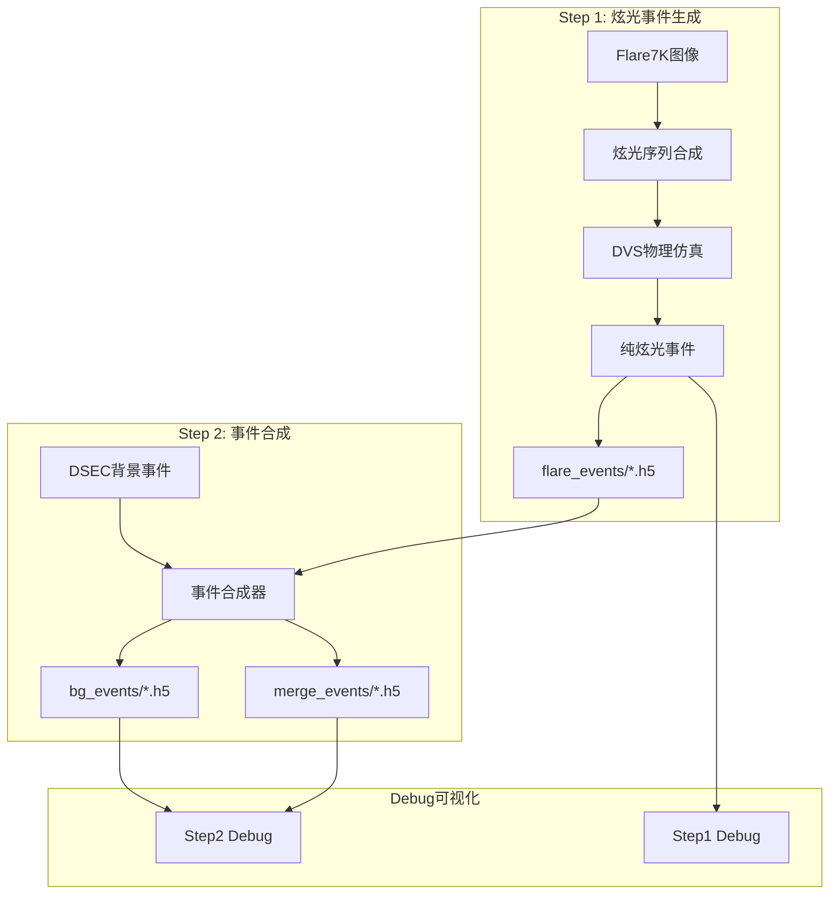

# EventMamba-FX Two-Step Event Generator Memory

## 🎯 项目核心定位
EventMamba-FX Two-Step Event Generator是一个**解耦的事件数据生成系统**，采用两步独立流程生成炫光事件和合成事件数据。

**🚀 重要：这是全新的two-step架构，完全解耦炫光生成和事件合成，输出标准DVS格式H5文件，移除了所有特征提取和标签生成。**

## Environment Setup 🔧 CRITICAL
- **MUST USE**: `source /home/lanpoknlanpokn/miniconda3/bin/activate event_flare`
- 环境包含必需依赖：PyTorch, NumPy, H5py, OpenCV, YAML, tqdm等
- Python 3.10.18，无需GPU（数据生成为CPU密集型）

## 🚀 系统状态：两步解耦架构 (2025-08-20 重构完成)

### ✅ 新架构核心特性
- **Step 1**: 独立炫光事件生成器 → `output/data/flare_events/*.h5`
- **Step 2**: 事件合成器 → `output/data/bg_events/*.h5` + `output/data/merge_events/*.h5`
- **标准DVS格式**: `/events/t, /events/x, /events/y, /events/p`
- **无特征提取**: 输出原始事件数据，无任何后处理
- **无标签生成**: 移除复杂的逐事件标签，专注纯事件数据
- **完全解耦**: 两步可独立运行，便于调试和修改

### 📊 新输出格式 (标准DVS H5格式)
```bash
# Step 1 输出：纯炫光事件
output/data/flare_events/flare_sequence_xxx.h5
├── /events/t  [N] int64    # 时间戳 (微秒)
├── /events/x  [N] uint16   # X坐标
├── /events/y  [N] uint16   # Y坐标  
└── /events/p  [N] int8     # 极性 (1/-1)

# Step 2 输出：背景事件 + 合并事件
output/data/bg_events/composed_sequence_xxx_bg.h5      # 背景事件
output/data/merge_events/composed_sequence_xxx_merge.h5  # 合并事件
# 同样的 /events/* 格式
```

### 🎮 新使用方式
```bash
# 完整流程
python main.py --debug

# 分步执行  
python main.py --step 1 --debug  # 只生成炫光事件
python main.py --step 2 --debug  # 只合成事件 (需要Step1先完成)

# 测试系统
python test_new_system.py
```

## 🏗️ 新架构组件

### 主要文件结构
```
EventMamba-FX-Two-Step-Generator/
├── main.py                          # 两步流程主入口 🆕
├── test_new_system.py               # 系统测试脚本 🆕
├── configs/
│   └── config.yaml                  # 两步模式配置 🔄
├── src/                             # 核心组件
│   ├── flare_event_generator.py     # Step1: 独立炫光生成器 🆕
│   ├── event_composer.py            # Step2: 事件合成器 🆕
│   ├── flare_synthesis.py           # 炫光图像合成 ✅
│   ├── dvs_flare_integration.py     # DVS仿真器集成 ✅
│   ├── dsec_efficient.py            # DSEC背景加载 ✅
│   ├── event_visualization_utils.py # Debug可视化 ✅
│   └── [legacy files]               # 旧文件保留，不再使用
├── simulator/
│   └── DVS-Voltmeter-main/          # DVS物理仿真器 ✅
├── data/
│   └── bg_events/                   # DSEC背景事件(输入) ✅
└── output/
    ├── data/                        # 新输出结构 🆕
    │   ├── flare_events/            # Step1: 纯炫光事件
    │   ├── bg_events/               # Step2: 背景事件
    │   └── merge_events/            # Step2: 合并事件
    └── debug/                       # Debug可视化 🆕
        ├── flare_generation/        # Step1 debug
        └── event_composition/       # Step2 debug
```

### 新数据流程 (完全解耦)


## 🚀 使用指南

### 快速开始 (推荐)
```bash
# 激活环境
source /home/lanpoknlanpokn/miniconda3/bin/activate event_flare

# 🆕 完整两步流程 (推荐)
python main.py --debug

# 🆕 分步执行
python main.py --step 1 --debug    # 只生成炫光事件
python main.py --step 2 --debug    # 只合成事件

# 🆕 系统测试
python test_new_system.py
```

### 新配置参数说明
```yaml
# configs/config.yaml 关键参数 (已更新)
generation:
  num_train_sequences: 10           # Step1: 训练用炫光序列数
  num_val_sequences: 5              # Step1: 验证用炫光序列数  
  debug_sequences: 3                # Debug模式序列数
  
  output_paths:
    flare_events: "output/data/flare_events"     # Step1输出
    bg_events: "output/data/bg_events"           # Step2输出
    merge_events: "output/data/merge_events"     # Step2输出

data:
  flare_synthesis:
    duration_range: [0.03, 0.08]                # 炫光事件时长(秒)
    
# 🆕 时间线设计 (100ms固定总长度)
timing_design:
  flare_start_offset: [0, 20]ms                 # 炫光随机起始时间
  flare_duration: [30, 80]ms                    # 炫光持续时间  
  total_sequence_length: 100ms                  # 固定总长度
  background_length: 100ms                      # 背景事件长度(固定)
```

## 📊 数据生成详细信息

### DSEC背景事件来源
- **文件位置**: `data/bg_events/*.h5` (7个文件)
- **数据量**: 32.7亿事件，291个1秒时间窗口
- **随机化**: 50-100ms随机时间窗口
- **文件列表**: interlaken_00_c.h5, interlaken_00_g.h5, thun_00_a.h5, zurich_city_00_a.h5, zurich_city_01_a.h5, zurich_city_04_a.h5, zurich_city_07_a.h5

### DVS炫光事件仿真
- **仿真器**: DVS-Voltmeter物理仿真器(唯一保留)
- **仿真器路径**: `simulator/DVS-Voltmeter-main/`
- **参数设置**: k1=2.5(降低敏感度), 完整6参数DVS346配置
- **时间窗口**: 30-80ms随机长度
- **图像源**: Flare7K数据集，5962张炫光图像

### 新输出数据格式 (标准DVS格式)
```python
# 🆕 标准DVS H5文件结构 (所有输出文件统一格式)
/events/t: (N,) int64     # 时间戳 (微秒，0-100ms范围)
/events/x: (N,) uint16    # X坐标 (像素)
/events/y: (N,) uint16    # Y坐标 (像素)  
/events/p: (N,) int8      # 极性 {1, -1} (DSEC格式)

# 🆕 时间线设计 (100ms统一时长)
flare_events/*.h5:    时间戳范围 0-100ms (随机起始偏移0-20ms)
bg_events/*.h5:       时间戳范围 0-100ms (固定100ms长度)  
merge_events/*.h5:    时间戳范围 0-100ms (背景+炫光合并)

# 🚫 移除的输出
# - 不再有features数组 (无特征提取)
# - 不再有labels数组 (无逐事件标签)
# - 不再有归一化处理 (输出原始数据)
```

## 🛠️ 新Debug模式功能

### Step 1 Debug输出
```
output/debug/flare_generation/
└── flare_sequence_XXX/
    ├── events_temporal_0.5x/    # 多分辨率事件可视化
    ├── events_temporal_1x/      # (0.5x, 1x, 2x, 4x)
    ├── events_temporal_2x/
    ├── events_temporal_4x/
    ├── source_frames/           # 原始炫光图像序列
    └── metadata.txt             # 炫光生成元数据
```

### Step 2 Debug输出  
```
output/debug/event_composition/
└── composition_XXX/
    ├── background_events/       # 背景事件可视化
    │   ├── temporal_0.5x/
    │   ├── temporal_1x/
    │   ├── temporal_2x/
    │   └── temporal_4x/
    ├── flare_events/           # 炫光事件可视化
    ├── merged_events/          # 合并事件可视化
    └── composition_metadata.txt # 合成统计信息
```

### 可视化特性
- **多分辨率时间窗口**: 0.5x, 1x, 2x, 4x时间倍数分析
- **事件类型颜色编码**: 背景(红/蓝), 炫光(黄/橙), 合并(白/灰)
- **PNG帧序列**: 每种分辨率生成30帧以内的可视化

## 📈 新性能指标 (2025-08-20)

### 🆕 两步架构性能预期
- **Step 1 (炫光生成)**: 预计60-90秒/序列 (移除特征提取开销)
- **Step 2 (事件合成)**: 预计20-40秒/序列 (纯数据合并)
- **总体提升**: 预计比原架构快40-60% (无特征提取)
- **内存使用**: <500MB峰值 (解耦降低内存峰值)
- **文件大小**: 根据事件数量，通常5-15MB/文件

### 🎯 新容量规划
```bash
# 🆕 Debug开发 (推荐)
Step1: 3-5炫光序列
Step2: 对应的背景+合并文件
生成时间: 5-10分钟
存储需求: 50-200MB

# 🆕 小规模实验
Step1: 10-20炫光序列  
Step2: 对应的事件合成
生成时间: 20-40分钟
存储需求: 200MB-1GB

# 🆕 中等规模数据集
Step1: 100-200炫光序列
Step2: 对应的事件合成
生成时间: 2-4小时  
存储需求: 2-8GB

# 🆕 大规模生产
Step1: 1000+炫光序列
Step2: 对应的事件合成
生成时间: 8-15小时
存储需求: 20-100GB
```

## 🔧 故障排除

### 常见问题及解决
1. **环境未激活**: 必须使用指定conda环境
2. **DVS仿真器超时**: 检查simulator/DVS-Voltmeter-main/路径
3. **Flare7K路径错误**: 检查配置中flare7k_path设置
4. **H5文件生成失败**: 检查data/generated_h5/权限
5. **生成速度慢**: 正常现象，单序列需要1-3分钟

### 🆕 验证系统健康
```bash
# 快速系统测试 (5-10分钟)
python test_new_system.py

# 预期输出
✅ Step 1: Generated 3 flare event files  
✅ Step 2: Generated 3 background + 3 merged event files
✅ H5 format compliance verified
✅ Debug visualizations generated

# 手动测试流程
python main.py --step 1 --debug     # 测试Step 1
python main.py --step 2 --debug     # 测试Step 2
```

### 🆕 故障排除步骤
1. **Step 1失败**: 检查DVS仿真器路径和Flare7K数据集
2. **Step 2失败**: 确保Step 1已成功生成炫光事件文件
3. **H5格式错误**: 检查生成的文件是否包含正确的/events/*结构
4. **Debug可视化缺失**: 确保使用--debug标志并检查权限
5. **内存不足**: 减少debug_sequences数量

## 📋 重要文件清单

### 🆕 核心必需文件 (新架构)
```
# 🆕 新架构核心文件
main.py                               # 两步流程主入口 🆕
test_new_system.py                    # 系统测试脚本 🆕
configs/config.yaml                   # 两步模式配置 🔄
src/flare_event_generator.py          # Step1: 炫光生成器 🆕
src/event_composer.py                 # Step2: 事件合成器 🆕

# 复用的支持组件
src/flare_synthesis.py                # 炫光图像合成 ✅
src/dvs_flare_integration.py          # DVS仿真器集成 ✅
src/dsec_efficient.py                 # DSEC数据加载 ✅
src/event_visualization_utils.py      # Debug可视化 ✅
simulator/DVS-Voltmeter-main/         # DVS仿真器 ✅
data/bg_events/                       # DSEC背景数据 ✅
```

### 🗂️ 文件状态说明
```
🆕 新创建文件: 实现两步解耦架构
🔄 修改文件: 适配新架构的配置
✅ 复用文件: 保持原有功能不变
🔒 保留文件: 旧架构文件保留但不再使用 (如unified_dataset.py)
🗑️ 无需文件: feature_extractor.py等后处理相关 (功能已移除)
```

## 🆕 新架构核心优势

### 设计优势对比
```
原架构 (复杂耦合)          →    新架构 (两步解耦)
├── 复杂的特征提取          →    ✅ 移除特征提取，输出原始数据
├── 复杂的标签生成          →    ✅ 移除逐事件标签
├── 单体生成流程            →    ✅ 解耦为两个独立步骤
├── 调试困难                →    ✅ 每步独立调试
├── 修改合成策略困难        →    ✅ Step2可独立修改合成策略
└── 特征格式固定            →    ✅ 标准DVS格式，通用性强
```

### 🚀 未来扩展能力
- **Step 1**: 可独立优化炫光生成策略，不影响Step 2
- **Step 2**: 可实验不同的事件合成算法 (时间交错、空间混合等)
- **输出格式**: DVS标准格式可直接用于其他DVS工具链
- **并行能力**: 两步可在不同机器上并行运行

## 💡 重启后快速上手

### 🆕 新系统快速验证
```bash
# 1. 激活环境
source /home/lanpoknlanpokn/miniconda3/bin/activate event_flare

# 2. 快速测试 (5-10分钟)
python test_new_system.py

# 3. 手动调试 (分步)
python main.py --step 1 --debug
python main.py --step 2 --debug  

# 4. 检查输出
ls -la output/data/flare_events/
ls -la output/data/bg_events/ 
ls -la output/data/merge_events/
ls -la output/debug/
```

### 🎯 新架构核心记忆点
- ✅ **两步解耦**: Step1生成炫光，Step2合成事件
- ✅ **标准DVS格式**: `/events/t,x,y,p` 原始数据输出
- ✅ **无后处理**: 移除特征提取和标签生成
- ✅ **独立调试**: 每步可单独运行和调试
- ✅ **灵活扩展**: 便于修改合成策略和参数

---

*架构重构完成: 2025-08-20 - 两步解耦架构，标准DVS格式输出，完全移除特征提取*