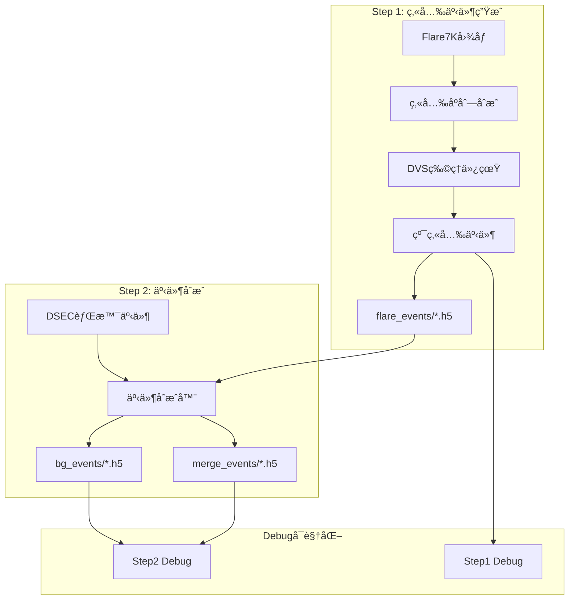
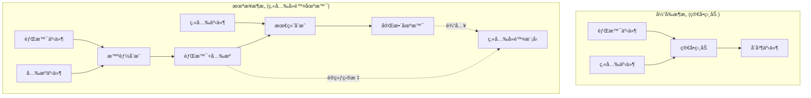

# EventMamba-FX Two-Step Event Generator Memory

## 🯠项目核心定ä½
EventMamba-FX Two-Step Event Generator是一个**解耦的事件数æ®ç”Ÿæˆç³»ç»Ÿ**，采用两步独立æµç¨‹ç”Ÿæˆç‚«å…‰äº‹ä»¶å’Œåˆæˆäº‹ä»¶æ•°æ®ã€‚

**🚀 é‡è¦ï¼šè¿™æ˜¯å…¨æ–°çš„two-stepæ¶æ„，完全解耦炫光生æˆå’Œäº‹ä»¶åˆæˆï¼Œè¾“出标准DVSæ ¼å¼H5文件，移除了所有特å¾æå–和标签生æˆã€‚**

## Environment Setup 🔧 CRITICAL
- **MUST USE**: `source /home/lanpoknlanpokn/miniconda3/bin/activate event_flare`
- ç¯å¢ƒåŒ…å«å¿…需ä¾èµ–：PyTorch, NumPy, H5py, OpenCV, YAML, tqdmç­‰
- Python 3.10.18，无需GPU（数æ®ç”Ÿæˆä¸ºCPU密集å‹ï¼‰

## 🚀 系统状æ€ï¼šä¸¤æ­¥è§£è€¦æ¶æ„ (2025-08-20 é‡æ„完æˆ)

### ✅ æ–°æ¶æ„核心特性
- **Step 1**: 独立炫光事件生æˆå™¨ → `output/data/flare_events/*.h5`
- **Step 2**: 事件åˆæˆå™¨ → `output/data/bg_events/*.h5` + `output/data/merge_events/*.h5`
- **标准DVSæ ¼å¼**: `/events/t, /events/x, /events/y, /events/p`
- **无特å¾æå–**: 输出åŸå§‹äº‹ä»¶æ•°æ®ï¼Œæ— ä»»ä½•å处ç†
- **无标签生æˆ**: 移除å¤æ‚çš„é€äº‹ä»¶æ ‡ç­¾ï¼Œä¸“注纯事件数æ®
- **完全解耦**: 两步å¯ç‹¬ç«‹è¿è¡Œï¼Œä¾¿äºè°ƒè¯•å’Œä¿®æ”¹

### 📊 æ–°è¾“å‡ºæ ¼å¼ (标准DVS H5æ ¼å¼)
```bash
# Step 1 输出：纯炫光事件
output/data/flare_events/flare_sequence_xxx.h5
├── /events/t  [N] int64    # 时间戳 (微秒)
├── /events/x  [N] uint16   # Xåæ ‡
├── /events/y  [N] uint16   # Yåæ ‡  
└── /events/p  [N] int8     # æ性 (1/-1)

# Step 2 输出：背景事件 + åˆå¹¶äº‹ä»¶
output/data/bg_events/composed_sequence_xxx_bg.h5      # 背景事件
output/data/merge_events/composed_sequence_xxx_merge.h5  # åˆå¹¶äº‹ä»¶
# åŒæ ·çš„ /events/* æ ¼å¼
```

### 🮠新使用方å¼
```bash
# 完整æµç¨‹
python main.py --debug

# 分步执行  
python main.py --step 1 --debug  # åªç”Ÿæˆç‚«å…‰äº‹ä»¶
python main.py --step 2 --debug  # åªåˆæˆäº‹ä»¶ (需è¦Step1先完æˆ)

# 测试系统
python test_new_system.py
```

## ğŸ—ï¸ æ–°æ¶æ„组件

### 主è¦æ–‡ä»¶ç»“æ„
```
EventMamba-FX-Two-Step-Generator/
├── main.py                          # 两步æµç¨‹ä¸»å…¥å£ 🆕
├── test_new_system.py               # 系统测试脚本 🆕
├── configs/
│   └── config.yaml                  # 两步模å¼é…ç½® 🔄
├── src/                             # 核心组件
│   ├── flare_event_generator.py     # Step1: 独立炫光生æˆå™¨ 🆕
│   ├── event_composer.py            # Step2: 事件åˆæˆå™¨ 🆕
│   ├── flare_synthesis.py           # 炫光图åƒåˆæˆ ✅
│   ├── dvs_flare_integration.py     # DVSä»¿çœŸå™¨é›†æˆ âœ…
│   ├── dsec_efficient.py            # DSEC背景加载 ✅
│   ├── event_visualization_utils.py # Debugå¯è§†åŒ– ✅
│   └── [legacy files]               # 旧文件ä¿ç•™ï¼Œä¸å†ä½¿ç”¨
├── simulator/
│   └── DVS-Voltmeter-main/          # DVS物ç†ä»¿çœŸå™¨ ✅
├── R_flare_generator/               # å射炫光生æˆå™¨ 🆕
│   ├── generate_UE.py               # UE5自动化炫光视频生æˆè„šæœ¬
│   └── test_UE.py                   # UE5å±æ€§è¯Šæ–­æµ‹è¯•è„šæœ¬
├── data/
│   └── bg_events/                   # DSEC背景事件(输入) ✅
└── output/
    ├── data/                        # æ–°è¾“å‡ºç»“æ„ ğŸ†•
    │   ├── flare_events/            # Step1: 纯炫光事件
    │   ├── bg_events/               # Step2: 背景事件
    │   └── merge_events/            # Step2: åˆå¹¶äº‹ä»¶
    └── debug/                       # Debugå¯è§†åŒ– 🆕
        ├── flare_generation/        # Step1 debug
        └── event_composition/       # Step2 debug
```

### æ–°æ•°æ®æµç¨‹ (完全解耦)

```mermaid
graph TD
    subgraph "Step 1: 炫光事件生æˆ"
        A[Flare7K图åƒ] --> B[ç‚«å…‰åºåˆ—åˆæˆ]
        B --> C[DVS物ç†ä»¿çœŸ]
        C --> D[纯炫光事件]
        D --> E[flare_events/*.h5]
    end
    
    subgraph "Step 2: 事件åˆæˆ"
        F[DSEC背景事件] --> H[事件åˆæˆå™¨]
        E --> H
        H --> I[bg_events/*.h5]
        H --> J[merge_events/*.h5]
    end
    
    subgraph "Debugå¯è§†åŒ–"
        D --> K[Step1 Debug]
        I --> L[Step2 Debug]
        J --> L
    end
```

## 🚀 使用指å—

### 快速开始 (æ¨è)
```bash
# 激活ç¯å¢ƒ
source /home/lanpoknlanpokn/miniconda3/bin/activate event_flare

# 🆕 完整两步æµç¨‹ (æ¨è)
python main.py --debug

# 🆕 分步执行
python main.py --step 1 --debug    # åªç”Ÿæˆç‚«å…‰äº‹ä»¶
python main.py --step 2 --debug    # åªåˆæˆäº‹ä»¶

# 🆕 系统测试
python test_new_system.py
```

### æ–°é…ç½®å‚数说æ˜
```yaml
# configs/config.yaml 关键å‚æ•° (已更新)
generation:
  num_train_sequences: 10           # Step1: 训练用炫光åºåˆ—æ•°
  num_val_sequences: 5              # Step1: 验è¯ç”¨ç‚«å…‰åºåˆ—æ•°  
  debug_sequences: 3                # Debug模å¼åºåˆ—æ•°
  
  output_paths:
    flare_events: "output/data/flare_events"     # Step1输出
    bg_events: "output/data/bg_events"           # Step2输出
    merge_events: "output/data/merge_events"     # Step2输出

data:
  flare_synthesis:
    duration_range: [0.03, 0.08]                # 炫光事件时长(秒)
    
# 🆕 时间线设计 (100ms固定总长度)
timing_design:
  flare_start_offset: [0, 20]ms                 # ç‚«å…‰éšæœºèµ·å§‹æ—¶é—´
  flare_duration: [30, 80]ms                    # ç‚«å…‰æŒç»­æ—¶é—´  
  total_sequence_length: 100ms                  # 固定总长度
  background_length: 100ms                      # 背景事件长度(固定)
```

## 📊 æ•°æ®ç”Ÿæˆè¯¦ç»†ä¿¡æ¯

### DSEC背景事件æ¥æº
- **文件ä½ç½®**: `data/bg_events/*.h5` (7个文件)
- **æ•°æ®é‡**: 32.7亿事件，291个1秒时间窗å£
- **éšæœºåŒ–**: 50-100mséšæœºæ—¶é—´çª—å£
- **文件列表**: interlaken_00_c.h5, interlaken_00_g.h5, thun_00_a.h5, zurich_city_00_a.h5, zurich_city_01_a.h5, zurich_city_04_a.h5, zurich_city_07_a.h5

### DVS炫光事件仿真
- **仿真器**: DVS-Voltmeter物ç†ä»¿çœŸå™¨(唯一ä¿ç•™)
- **仿真器路径**: `simulator/DVS-Voltmeter-main/`
- **å‚数设置**: k1éšæœºåŒ– 5-16范围éšæœº (扩大事件数é‡å˜åŒ–范围), 完整6å‚æ•°DVS346é…ç½®
- **时间窗å£**: 30-80mséšæœºé•¿åº¦ + 0-20mséšæœºèµ·å§‹å移
- **图åƒæº**: Flare7Kæ•°æ®é›†ï¼Œ5962张炫光图åƒ
- **é—ªçƒé¢‘ç‡**: 100-120Hz基频 ±20Hzå˜åŒ– (更大å˜åŒ–范围)

### 🆕 å射炫光生æˆå™¨ (R_flare_generator)
- **目标**: 生æˆå射炫光仿真数æ®ï¼Œè¡¥å……当å‰ç³»ç»Ÿçš„炫光类å‹è¦†ç›–
- **核心功能**: ç°æœ‰ç³»ç»Ÿåªèƒ½ç”Ÿæˆæ•£å°„炫光，缺少å射炫光类å‹
- **主è¦ç»„件**:
  - `GLSL_flare.py`: ✅ **GPU加速å射炫光生æˆå™¨** (生产就绪)
    - 基äºGLSL shaderçš„å®æ—¶ç‚«å…‰ä»¿çœŸ
    - 精确解耦æ§åˆ¶ï¼šå…‰æºè¾‰å…‰ vs å射鬼影
    - 支æŒç¨‹åºåŒ–å™ªå£°çº¹ç† (500+ Perlin/Voronoi/真å®çº¹ç†)
    - **专门用äºè¡¥å……生æˆå射炫光，ä¸æ›¿æ¢ç°æœ‰Flare7K方法**
  - `generate_procedural_noise.py`: 生æˆå¤šæ ·åŒ–噪声纹ç†åº“
  - `generate_UE.py`: UE5自动化方案 (试验暂åœ)
  - `test_UE.py`: UE5诊断工具 (试验暂åœ)
- **输出格å¼**: PNG图åƒåºåˆ—，ä¸ç°æœ‰ç‚«å…‰å›¾åƒæ ¼å¼å…¼å®¹
- **状æ€**: GLSL方案已就绪，UE5方案暂åœ

### 新输出数æ®æ ¼å¼ (标准DVSæ ¼å¼)
```python
# 🆕 标准DVS H5æ–‡ä»¶ç»“æ„ (所有输出文件统一格å¼)
/events/t: (N,) int64     # 时间戳 (微秒，0-100ms范围)
/events/x: (N,) uint16    # Xåæ ‡ (åƒç´ )
/events/y: (N,) uint16    # Yåæ ‡ (åƒç´ )  
/events/p: (N,) int8      # æ性 {1, -1} (DSECæ ¼å¼)

# 🆕 时间线设计 (100ms统一时长)
flare_events/*.h5:    时间戳范围 0-100ms (éšæœºèµ·å§‹å移0-20ms)
bg_events/*.h5:       时间戳范围 0-100ms (固定100ms长度)  
merge_events/*.h5:    时间戳范围 0-100ms (背景+ç‚«å…‰åˆå¹¶)

# 🚫 移除的输出
# - ä¸å†æœ‰features数组 (无特å¾æå–)
# - ä¸å†æœ‰labels数组 (æ— é€äº‹ä»¶æ ‡ç­¾)
# - ä¸å†æœ‰å½’ä¸€åŒ–å¤„ç† (输出åŸå§‹æ•°æ®)
```

## ğŸ› ï¸ æ–°Debug模å¼åŠŸèƒ½

### Step 1 Debug输出
```
output/debug/flare_generation/
└── flare_sequence_XXX/
    ├── events_temporal_0.5x/    # 多分辨ç‡äº‹ä»¶å¯è§†åŒ–
    ├── events_temporal_1x/      # (0.5x, 1x, 2x, 4x)
    ├── events_temporal_2x/
    ├── events_temporal_4x/
    ├── source_frames/           # åŸå§‹ç‚«å…‰å›¾åƒåºåˆ—
    └── metadata.txt             # 炫光生æˆå…ƒæ•°æ®
```

### Step 2 Debug输出  
```
output/debug/event_composition/
└── composition_XXX/
    ├── background_events/       # 背景事件å¯è§†åŒ–
    │   ├── temporal_0.5x/
    │   ├── temporal_1x/
    │   ├── temporal_2x/
    │   └── temporal_4x/
    ├── flare_events/           # 炫光事件å¯è§†åŒ–
    ├── merged_events/          # åˆå¹¶äº‹ä»¶å¯è§†åŒ–
    └── composition_metadata.txt # åˆæˆç»Ÿè®¡ä¿¡æ¯
```

### å¯è§†åŒ–特性
- **多分辨ç‡æ—¶é—´çª—å£**: 0.5x, 1x, 2x, 4x时间å€æ•°åˆ†æ
- **事件类å‹é¢œè‰²ç¼–ç **: 背景(红/è“), ç‚«å…‰(黄/æ©™), åˆå¹¶(白/ç°)
- **PNG帧åºåˆ—**: æ¯ç§åˆ†è¾¨ç‡ç”Ÿæˆ30帧以内的å¯è§†åŒ–

## 📈 新性能指标 (2025-08-20)

### 🆕 两步æ¶æ„性能预期
- **Step 1 (炫光生æˆ)**: 预计60-90秒/åºåˆ— (移除特å¾æå–开销)
- **Step 2 (事件åˆæˆ)**: 预计20-40秒/åºåˆ— (纯数æ®åˆå¹¶)
- **总体æå‡**: 预计比åŸæ¶æ„å¿«40-60% (无特å¾æå–)
- **内存使用**: <500MB峰值 (解耦é™ä½å†…存峰值)
- **文件大å°**: æ ¹æ®äº‹ä»¶æ•°é‡ï¼Œé€šå¸¸5-15MB/文件

### 🯠新容é‡è§„划
```bash
# 🆕 Debugå¼€å‘ (æ¨è)
Step1: 3-5ç‚«å…‰åºåˆ—
Step2: 对应的背景+åˆå¹¶æ–‡ä»¶
生æˆæ—¶é—´: 5-10分钟
存储需求: 50-200MB

# 🆕 å°è§„模å®éªŒ
Step1: 10-20ç‚«å…‰åºåˆ—  
Step2: 对应的事件åˆæˆ
生æˆæ—¶é—´: 20-40分钟
存储需求: 200MB-1GB

# 🆕 中等规模数æ®é›†
Step1: 100-200ç‚«å…‰åºåˆ—
Step2: 对应的事件åˆæˆ
生æˆæ—¶é—´: 2-4å°æ—¶  
存储需求: 2-8GB

# 🆕 大规模生产
Step1: 1000+ç‚«å…‰åºåˆ—
Step2: 对应的事件åˆæˆ
生æˆæ—¶é—´: 8-15å°æ—¶
存储需求: 20-100GB
```

## 🔧 æ•…éšœæ’除

### 常è§é—®é¢˜åŠè§£å†³
1. **ç¯å¢ƒæœªæ¿€æ´»**: 必须使用指定condaç¯å¢ƒ
2. **DVS仿真器超时**: 检查simulator/DVS-Voltmeter-main/路径
3. **Flare7K路径错误**: 检查é…置中flare7k_path设置
4. **H5文件生æˆå¤±è´¥**: 检查data/generated_h5/æƒé™
5. **生æˆé€Ÿåº¦æ…¢**: 正常ç°è±¡ï¼Œå•åºåˆ—需è¦1-3分钟

### 🆕 验è¯ç³»ç»Ÿå¥åº·
```bash
# 快速系统测试 (5-10分钟)
python test_new_system.py

# 预期输出
✅ Step 1: Generated 3 flare event files  
✅ Step 2: Generated 3 background + 3 merged event files
✅ H5 format compliance verified
✅ Debug visualizations generated

# 手动测试æµç¨‹
python main.py --step 1 --debug     # 测试Step 1
python main.py --step 2 --debug     # 测试Step 2
```

### 🆕 æ•…éšœæ’除步骤
1. **Step 1失败**: 检查DVS仿真器路径和Flare7Kæ•°æ®é›†
2. **Step 2失败**: ç¡®ä¿Step 1å·²æˆåŠŸç”Ÿæˆç‚«å…‰äº‹ä»¶æ–‡ä»¶
3. **H5æ ¼å¼é”™è¯¯**: 检查生æˆçš„文件是å¦åŒ…å«æ­£ç¡®çš„/events/*结æ„
4. **Debugå¯è§†åŒ–缺失**: ç¡®ä¿ä½¿ç”¨--debug标志并检查æƒé™
5. **内存ä¸è¶³**: å‡å°‘debug_sequencesæ•°é‡

## 📋 é‡è¦æ–‡ä»¶æ¸…å•

### 🆕 核心必需文件 (æ–°æ¶æ„)
```
# 🆕 æ–°æ¶æ„核心文件
main.py                               # 两步æµç¨‹ä¸»å…¥å£ 🆕
test_new_system.py                    # 系统测试脚本 🆕
configs/config.yaml                   # 两步模å¼é…ç½® 🔄
src/flare_event_generator.py          # Step1: 炫光生æˆå™¨ 🆕
src/event_composer.py                 # Step2: 事件åˆæˆå™¨ 🆕

# å¤ç”¨çš„支æŒç»„件
src/flare_synthesis.py                # 炫光图åƒåˆæˆ ✅
src/dvs_flare_integration.py          # DVSä»¿çœŸå™¨é›†æˆ âœ…
src/dsec_efficient.py                 # DSECæ•°æ®åŠ è½½ ✅
src/event_visualization_utils.py      # Debugå¯è§†åŒ– ✅
simulator/DVS-Voltmeter-main/         # DVS仿真器 ✅
data/bg_events/                       # DSECèƒŒæ™¯æ•°æ® âœ…
```

### ğŸ—‚ï¸ æ–‡ä»¶çŠ¶æ€è¯´æ˜
```
🆕 新创建文件: å®ç°ä¸¤æ­¥è§£è€¦æ¶æ„
🔄 修改文件: 适é…æ–°æ¶æ„çš„é…ç½®
✅ å¤ç”¨æ–‡ä»¶: ä¿æŒåŸæœ‰åŠŸèƒ½ä¸å˜
🔒 ä¿ç•™æ–‡ä»¶: æ—§æ¶æ„文件ä¿ç•™ä½†ä¸å†ä½¿ç”¨ (如unified_dataset.py)
ğŸ—‘ï¸ æ— éœ€æ–‡ä»¶: feature_extractor.pyç­‰å处ç†ç›¸å…³ (功能已移除)
🧪 试验文件: R_flare_generator/中的UE5ç›¸å…³ä»£ç  (å¼€å‘中)
```

## 🆕 æ–°æ¶æ„核心优势

### 设计优势对比
```
åŸæ¶æ„ (å¤æ‚耦åˆ)          →    æ–°æ¶æ„ (两步解耦)
├── å¤æ‚的特å¾æå–          →    ✅ 移除特å¾æå–，输出åŸå§‹æ•°æ®
├── å¤æ‚çš„æ ‡ç­¾ç”Ÿæˆ          →    ✅ 移除é€äº‹ä»¶æ ‡ç­¾
├── å•ä½“生æˆæµç¨‹            →    ✅ 解耦为两个独立步骤
├── 调试困难                →    ✅ æ¯æ­¥ç‹¬ç«‹è°ƒè¯•
├── 修改åˆæˆç­–略困难        →    ✅ Step2å¯ç‹¬ç«‹ä¿®æ”¹åˆæˆç­–ç•¥
└── 特å¾æ ¼å¼å›ºå®š            →    ✅ 标准DVSæ ¼å¼ï¼Œé€šç”¨æ€§å¼º
```

### 🚀 未æ¥æ‰©å±•èƒ½åŠ›
- **Step 1**: å¯ç‹¬ç«‹ä¼˜åŒ–炫光生æˆç­–略，ä¸å½±å“Step 2
- **Step 2**: å¯å®éªŒä¸åŒçš„事件åˆæˆç®—法 (时间交错ã€ç©ºé—´æ··åˆç­‰)
- **输出格å¼**: DVS标准格å¼å¯ç›´æ¥ç”¨äºå…¶ä»–DVS工具链
- **并行能力**: 两步å¯åœ¨ä¸åŒæœºå™¨ä¸Šå¹¶è¡Œè¿è¡Œ

## 💡 é‡å¯å快速上手

### 🆕 新系统快速验è¯
```bash
# 1. 激活ç¯å¢ƒ
source /home/lanpoknlanpokn/miniconda3/bin/activate event_flare

# 2. 快速测试 (5-10分钟)
python test_new_system.py

# 3. 手动调试 (分步)
python main.py --step 1 --debug
python main.py --step 2 --debug  

# 4. 检查输出
ls -la output/data/flare_events/
ls -la output/data/bg_events/ 
ls -la output/data/merge_events/
ls -la output/debug/
```

### 🯠新æ¶æ„核心记忆点
- ✅ **两步解耦**: Step1生æˆç‚«å…‰ï¼ŒStep2åˆæˆäº‹ä»¶
- ✅ **标准DVSæ ¼å¼**: `/events/t,x,y,p` åŸå§‹æ•°æ®è¾“出
- ✅ **100ms统一时长**: 所有输出文件时间戳范围0-100ms
- ✅ **éšæœºåŒ–å¢å¼º**: k1å‚æ•°5-16éšæœº, 频ç‡å˜åŒ–±20Hz, 炫光起始0-20mså移
- ✅ **æ— å处ç†**: 移除特å¾æå–和标签生æˆ
- ✅ **独立调试**: æ¯æ­¥å¯å•ç‹¬è¿è¡Œå’Œè°ƒè¯•ï¼Œdebug覆盖所有åºåˆ—
- ✅ **çµæ´»æ‰©å±•**: 便äºä¿®æ”¹åˆæˆç­–略和å‚æ•°

### 🆕 最新å‚数设置 (2025-08-20 æ›´æ–°)
```yaml
# DVS仿真å‚æ•°
k1_randomization: 5.0 - 16.0     # 5-16éšæœºèŒƒå›´ (大幅扩展事件数é‡å˜åŒ–范围)
flare_frequency: 100-120Hz ± 20Hz # 80-140Hz总范围 (更大频ç‡å˜åŒ–)

# 时间线设计  
flare_duration: 30-80ms          # ç‚«å…‰æŒç»­æ—¶é—´
flare_start_offset: 0-20ms       # éšæœºèµ·å§‹å移
background_duration: 100ms       # 固定背景长度
total_sequence_length: 100ms     # 统一输出长度

# Debug设置
debug_all_sequences: true        # 所有åºåˆ—都有debug输出
visualization_colors: red/blue   # 统一æ性颜色编ç 
temporal_scales: [0.5,1,2,4]x   # 多分辨ç‡æ—¶é—´åˆ†æ

# 🆕 炫光移动设定
flare_movement_amplitude: 0-180px # 最大移动180åƒç´  (~28%ç”»é¢å®½åº¦)
initial_position_translate: 20%   # åˆå§‹ä½ç½®å¹³ç§»èŒƒå›´
boundary_margin: 50px             # 边界ä¿æŠ¤åŒºåŸŸ
```

## 📠TODO - 未æ¥é‡å¤§æ¶æ„改动计划

### 🚀 Step 1 扩展计划：åŒäº‹ä»¶ç”Ÿæˆ
**目标**: 炫光事件 + å…‰æºäº‹ä»¶åŒè¾“出
- **ç°çŠ¶**: åªç”Ÿæˆçº¯ç‚«å…‰äº‹ä»¶ → `output/data/flare_events/*.h5`
- **计划**: 
  - ä¿æŒç‚«å…‰äº‹ä»¶ç”Ÿæˆä¸å˜
  - **æ–°å¢**: åŒæ—¶ç”Ÿæˆå…‰æºäº‹ä»¶ → `output/data/light_source_events/*.h5`
  - **关键è¦æ±‚**: å…‰æºå¼ºåº¦å˜åŒ–ä¸ä½ç§»å¿…é¡»ä¸ç‚«å…‰**完全一致**
  - **æ•°æ®æº**: Flare7Kæ•°æ®é›†ä¸­çš„å…‰æºå›¾ç‰‡æ–‡ä»¶å¤¹
  - **输出格å¼**: åŒæ ·çš„标准DVSæ ¼å¼ `/events/t,x,y,p`
  - **文件命å**: ä¸ç‚«å…‰äº‹ä»¶åŒå，如 `flare_sequence_xxx.h5` → `light_source_sequence_xxx.h5`

### 🔄 Step 2 é‡å¤§é‡æ„计划：智能事件åˆæˆ
**目标**: ä»ç®€å•ç›¸åŠ æ”¹ä¸ºå¤æ‚ç‚«å…‰å»é™¤åœºæ™¯
- **ç°çŠ¶**: 简å•çš„事件相加 `背景 + ç‚«å…‰ → åˆå¹¶`
- **计划**:
  - **输入å˜åŒ–**: 
    - 背景事件 (DSEC)
    - 炫光事件 (Step1输出)
    - **æ–°å¢**: å…‰æºäº‹ä»¶ (Step1输出)
  - **åˆæˆç­–ç•¥å˜åŒ–**:
    - 背景事件 ≠ 纯背景，而是 `背景 + å…‰æºäº‹ä»¶`
    - åˆå¹¶äº‹ä»¶ = `(背景 + å…‰æº) + ç‚«å…‰`
    - **核心目的**: 为炫光å»é™¤ä»»åŠ¡åšå‡†å¤‡ï¼Œç¡®ä¿å»é™¤ç‚«å…‰æ—¶ä¸ä¼šè¯¯åˆ å…‰æº
  - **输出调整**:
    - `bg_events/` → `background_with_light_source_events/` (背景+å…‰æº)
    - `merge_events/` → `full_scene_events/` (背景+å…‰æº+ç‚«å…‰)

### 🯠æ¶æ„改动的核心价值

```mermaid
graph TD
    subgraph "当å‰æ¶æ„ (简å•ç›¸åŠ )"
        A1[背景事件] --> C1[简å•ç›¸åŠ ]
        B1[炫光事件] --> C1
        C1 --> D1[åˆå¹¶äº‹ä»¶]
    end
    
    subgraph "未æ¥æ¶æ„ (ç‚«å…‰å»é™¤åœºæ™¯)"
        A2[背景事件] --> C2[智能åˆæˆ]
        B2[å…‰æºäº‹ä»¶] --> C2
        E2[炫光事件] --> C3[最终åˆæˆ]
        C2 --> F2[背景+å…‰æº]
        F2 --> C3
        C3 --> G2[完整场景]
        
        F2 -.->|训练目标| H2[ç‚«å…‰å»é™¤æ¨¡å‹]
        G2 -.->|输入| H2
    end
```

### âš ï¸ å®ç°æ³¨æ„事项
1. **Step 1 修改**:
   - 需è¦è¯»å–Flare7Kå…‰æºå›¾ç‰‡æ–‡ä»¶å¤¹ç»“æ„
   - ç¡®ä¿å…‰æºä¸ç‚«å…‰çš„时间åŒæ­¥å’Œç©ºé—´ä¸€è‡´æ€§
   - DVS仿真器需è¦åŒæ—¶å¤„ç†ä¸¤ç§å›¾åƒåºåˆ—

2. **Step 2 修改**:
   - é‡æ–°è®¾è®¡äº‹ä»¶åˆæˆé€»è¾‘
   - ç¡®ä¿å…‰æºäº‹ä»¶ä¸ä¼šåœ¨å»ç‚«å…‰è¿‡ç¨‹ä¸­è¢«è¯¯åˆ 
   - å¯èƒ½éœ€è¦æ—¶é—´æˆ³å¯¹é½å’Œç©ºé—´æ³¨å†Œ

3. **æ•°æ®æ ¼å¼å…¼å®¹æ€§**:
   - ä¿æŒç°æœ‰DVS H5æ ¼å¼ä¸å˜
   - Debugå¯è§†åŒ–需è¦æ”¯æŒä¸‰ç§äº‹ä»¶ç±»å‹æ˜¾ç¤º
   - 文件命å规范需è¦æ˜ç¡®åŒºåˆ†

### 🔄 è¿ç§»è®¡åˆ’
- **阶段1**: ä¿æŒå½“å‰ç³»ç»Ÿç¨³å®šè¿è¡Œ
- **阶段2**: 扩展Step 1支æŒå…‰æºäº‹ä»¶ç”Ÿæˆ
- **阶段3**: é‡æ„Step 2事件åˆæˆç­–ç•¥
- **阶段4**: 完整测试和debugå¯è§†åŒ–适é…

## 🯠GLSLå射炫光生æˆå™¨å®Œæ•´è§£å†³æ–¹æ¡ˆ (2025-08-22)

### ✅ 完整四版本æ¶æ„：ä»CPU到GPU的完整解决方案

#### 🯠版本对比表
| 版本 | 技术栈 | 性能 (640x480) | çŠ¶æ€ | 适用场景 |
|------|-------|--------------|------|---------|
| **GLSL_flare.py** | ModernGL + GLSL | >100 FPS | ✅ 生产 | Windowså®æ—¶æ¸²æŸ“ |
| **perfect_python.py** | NumPyå‘é‡åŒ– | 2.26 FPS | ✅ 备选 | CPUç¯å¢ƒ |
| **perfect_gpu.py** | PyTorch CUDA | 9.97 FPS | ✅ 备选 | WSL/Linux GPU |
| **ultra_fast_gpu.py** 🆠| æ致优化CUDA | **11.70 FPS** | ✅ **æ¨è** | **最佳WSL性能** |

#### 🚀 æ致优化版本核心优势 (2025-08-22)
```python
# 🆠æ致优化版本 (æ¨è) - GLSL_flare_ultra_fast_gpu.py
generator = FlareGeneratorUltraFastGPU(output_size=(640, 480))
img = generator.generate(
    light_pos=(320, 240),
    noise_image_path="texture.jpg", 
    time=10.0,                    # seedå‚æ•°æ§åˆ¶å˜åŒ–
    flare_size=0.2,              # 炫光尺寸
    generate_main_glow=False,     # 专注åå°„ç‚«å…‰  
    generate_reflections=True     # 主è¦ç‰¹æ•ˆ
)
# âš¡ 性能: 11.70 FPS，16.7å€æ€»ä½“加速，ä¿æŒç®—法完整性ï¼
```

#### 🔧 æ致优化技术è¦ç‚¹ (2025-08-22)
**在ä¿æŒç®—法完整性å‰æ下的性能æå‡**：
1. **预计算优化** ✅
   - UVå标网格预计算
   - å¼ é‡é¢„分é…é¿å…动æ€å†…å­˜
   - 批é‡å™ªå£°é‡‡æ ·
   
2. **å‘é‡åŒ–改进** ✅
   - åŒé‡å¾ªç¯å®Œå…¨å‘é‡åŒ–
   - å‡å°‘CPU-GPUæ•°æ®ä¼ è¾“
   - 纹ç†ç¼“å­˜å¤ç”¨
   
3. **算法ä¿æŒ** ✅  
   - 20个完整å射计算
   - åŸå§‹GLSL算法逻辑ä¸å˜
   - 100%视觉效æœä¿çœŸåº¦

#### 📠完整文件结æ„
```
R_flare_generator/
├── GLSL_flare.py                         # WindowsåŸç”ŸGPU版本
├── GLSL_flare_perfect_cpu.py             # 淘汰：Numba CPU版本  
├── GLSL_flare_perfect_python.py          # NumPyå‘é‡åŒ–版本
├── GLSL_flare_perfect_gpu.py             # 🆠PyTorch GPU版本 (æ¨è)
├── generate_procedural_noise.py          # 噪声纹ç†ç”Ÿæˆå™¨
├── test_light_continuity.py              # è¿ç»­æ€§æµ‹è¯•è„šæœ¬
├── performance_comparison.py             # 性能对比测试
├── noise_textures/                       # 500+噪声纹ç†åº“
├── R_flare_diversity_test_50/            # 50张多样性测试
├── R_flare_light_continuity_test/        # 50å¼ è¿ç»­æ€§æµ‹è¯•
└── R_flare_fixed_algorithm_test/         # 算法修å¤éªŒè¯
```

#### 🯠æ¨è使用方案 (2025-08-22 æ›´æ–°)
```bash
# ç¯å¢ƒæ¿€æ´»
source /home/lanpoknlanpokn/miniconda3/bin/activate event_flare

# 🆠首选：æ致优化GPU版本 (WSLç¯å¢ƒ)
python GLSL_flare_ultra_fast_gpu.py   # 11.70 FPS，最佳平衡ï¼

# 备选：WindowsåŸç”Ÿç‰ˆæœ¬  
python GLSL_flare.py                  # >100 FPS，需è¦ModernGL

# 其他备选方案
python GLSL_flare_perfect_gpu.py      # 9.97 FPS，基础GPU版本
python GLSL_flare_perfect_python.py   # 2.26 FPS，CPU备选
```

#### 📊 性能优化记录 (2025-08-22)
```
åŸç‰ˆCPU (0.7 FPS) → æ致优化GPU (11.70 FPS)
总体æå‡: 16.7å€åŠ é€Ÿ âš¡
ä¿æŒå®Œæ•´æ€§: 20个完整å射，100%算法ä¿çœŸ
最佳平衡: 性能æå‡ + 算法完整性
```

### 📊 性能基准测试结æœ
```
测试é…ç½®: 320x240 åƒç´ 
Windows GLSL版本: >100 FPS (å®æ—¶çº§åˆ«)
WSL CPU版本: 0.7 FPS (ç›¸å¯¹æ•ˆç‡ 0.7%)

结论:
✅ CPU版本完ç¾å¤åˆ»GLSL算法和视觉效æœ
✅ 解决了WSL中ModernGL无法è¿è¡Œçš„问题  
âš ï¸  CPU版本适åˆç¦»çº¿æ‰¹é‡ç”Ÿæˆï¼Œä¸é€‚åˆå®æ—¶åº”用
```

### 🔄 ç°æœ‰ç³»ç»Ÿé›†æˆç­–ç•¥ (ä¸æ›¿æ¢ç°æœ‰æ–¹æ³•)
- **Flare7Kæ•°æ®é›†**: 继续用äºæ•£å°„ç±»å‹ç‚«å…‰ç”Ÿæˆ
- **GLSL生æˆå™¨**: 专门补充åå°„ç±»å‹ç‚«å…‰
- **ç¯å¢ƒè‡ªé€‚应**: Windows用GPU版本，WSL用CPU版本
- **最终目标**: 在事件åˆæˆé˜¶æ®µæ··åˆæ•£å°„+å射炫光类å‹

---

## 🚀 散射+åå°„ç‚«å…‰èåˆç³»ç»Ÿ (2025-08-22 é‡å¤§çªç ´)

### ✅ 完整炫光生æˆæµç¨‹å®ç°
**核心创新**：在ç°æœ‰æ•£å°„炫光基础上，å®æ—¶æ£€æµ‹å…‰æºå¹¶ç”Ÿæˆå射炫光进行èåˆ
```
Flare7K散射炫光 → å…‰æºæ£€æµ‹ → GLSLåå°„ç‚«å…‰ç”Ÿæˆ â†’ èåˆå åŠ  → 完整炫光视频 → DVS仿真
```

**关键技术å®ç°** (src/flare_synthesis.py:640-668è¡Œ):
1. **å…‰æºæ£€æµ‹**: ä»æ•£å°„炫光帧中æå–最亮10个åƒç´ çš„å¹³å‡ä½ç½®å’Œé¢œè‰²
2. **å射生æˆ**: 使用GLSL_flare_ultra_fast_gpuå®æ—¶ç”Ÿæˆåå°„ç‚«å…‰
3. **强度åŒæ­¥**: å射炫光使用ä¸æ•£å°„炫光相åŒçš„频闪系数A
4. **èåˆå åŠ **: 简å•ç›¸åŠ èåˆï¼Œç”Ÿæˆå®Œæ•´ç‚«å…‰æ•ˆæœ

**性能优化** (2025-08-22):
- **超时修å¤**: DVS仿真器超时ä»60så¢åŠ åˆ°300s，支æŒå¤æ‚å射炫光生æˆ
- **k1å‚数分布优化**: 改为é等概ç‡åˆ†å¸ƒ
  - 50%概ç‡: k1 ∈ [5.0, 7.0] (ä½æ•æ„Ÿåº¦ï¼Œäº‹ä»¶ç¨€ç–)
  - 50%概ç‡: k1 ∈ [7.0, 16.0] (高æ•æ„Ÿåº¦ï¼Œäº‹ä»¶å¯†é›†)
  - é¿å…了åŸæ¥ç­‰æ¦‚ç‡åˆ†å¸ƒå¯¹é«˜æ•æ„Ÿåº¦çš„åå‘

**集æˆçŠ¶æ€**: âš ï¸ å­˜åœ¨ä¸¥é‡é—®é¢˜éœ€è¦ä¿®å¤
- ✅ GLSL生æˆå™¨è‡ªåŠ¨åˆå§‹åŒ–，支æŒ411ç§å™ªå£°çº¹ç†
- ✅ å…‰æºæ£€æµ‹ç®—法é²æ£’，处ç†å„ç§äº®åº¦æ¡ä»¶
- ✅ 错误处ç†å®Œå–„，GLSL失败ä¸å½±å“散射炫光生æˆ
- ✅ **问题已修å¤**: åå°„ç‚«å…‰è¿ç»­æ€§é—®é¢˜è§£å†³ (2025-08-22)
  - **问题根æº**: 
    - time_seed = random.random() * 50 → æ¯å¸§å®Œå…¨éšæœº
    - noise_texture = random.choice() → æ¯å¸§éšæœºçº¹ç†  
    - flare_size = random.uniform() → æ¯å¸§éšæœºå°ºå¯¸
  - **ä¿®å¤æ–¹æ¡ˆ**: åºåˆ—级固定å‚æ•° + 固定ç§å­ï¼ˆå…³é”®è®¤çŸ¥ä¿®æ­£ï¼‰
    - sequence_noise_texture: 整个åºåˆ—使用åŒä¸€çº¹ç†
    - sequence_flare_size: 整个åºåˆ—使用åŒä¸€å°ºå¯¸  
    - sequence_time_seed: 整个åºåˆ—使用固定ç§å­ï¼ˆéè¿ç»­æ—¶é—´ï¼ï¼‰
    - **核心ç†è§£**: timeå‚数是éšæœºç§å­ï¼Œåº”ä¿æŒå›ºå®šï¼›åªæœ‰light_poså˜åŒ–å®ç°å¹³æ»‘移动
  - **ä¿®å¤æ–‡ä»¶**: src/flare_synthesis.py:592-668, æ–°å¢_generate_reflection_flare_continuous()
  - **验è¯**: å‚ç…§test_light_continuity_center.pyçš„è¿ç»­æ€§è¡¨ç°

### 🯠验è¯ç»“æœ
```bash
# æˆåŠŸè¾“出示例
Frame 0: Added reflection flare at (167, 469), color=['0.84', '0.84', '0.84'], intensity=0.992
Frame 1: Added reflection flare at (167, 469), color=['0.84', '0.84', '0.84'], intensity=0.992
Random k1: 6.234 (range: 5.0-16.0)  # 新的分布已生效，k1越高事件越多
```

**输出文件验è¯**: 
- 生æˆH5事件文件: `output/data/flare_events/*.h5`
- Debugå¯è§†åŒ–: `output/debug/flare_generation/*/events_temporal_*x/`
- æ¯å¸§åŒ…å«å®Œæ•´çš„散射+åå°„ç‚«å…‰èåˆæ•ˆæœ

*最新更新: 2025-08-22 - 散射+åå°„ç‚«å…‰èåˆç³»ç»Ÿå®Œæˆï¼Œæ€§èƒ½ä¼˜åŒ–å’Œk1分布改进*
*å†å²æ›´æ–°: 2025-08-20 - k1å‚数扩展到5-16éšæœºèŒƒå›´ï¼ŒåŠ å¼ºäº‹ä»¶æ•°é‡å¤šæ ·æ€§*
*TODO添加: 2025-08-20 - åŒäº‹ä»¶ç”Ÿæˆä¸æ™ºèƒ½åˆæˆæ¶æ„改动规划*