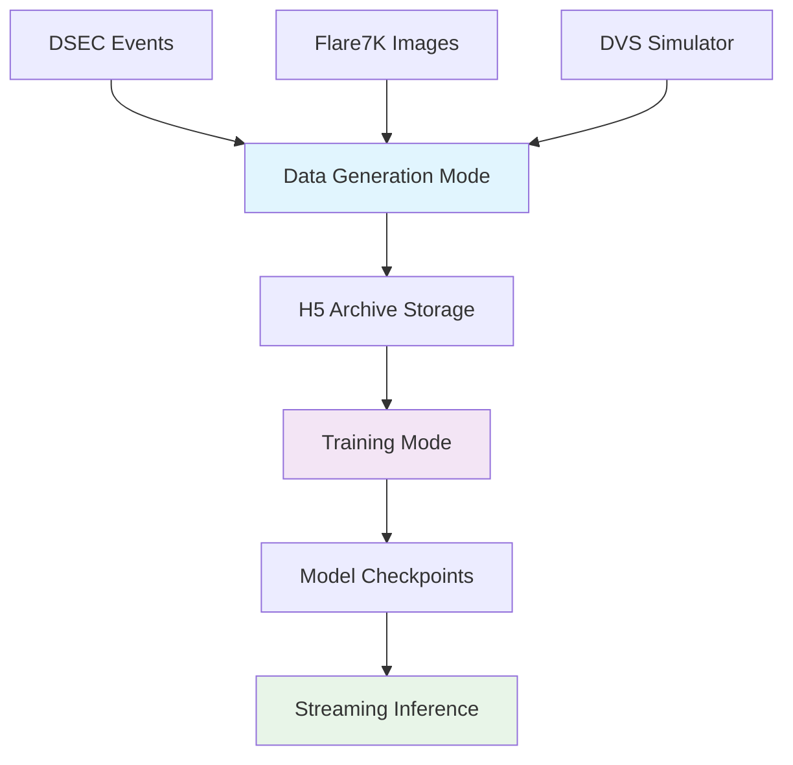

# EventMamba-FX: Feature-Augmented Mamba for Real-time Event Denoising

[](https://www.python.org/downloads/release/python-3100/)
[](https://pytorch.org/)  
[](https://github.com/state-spaces/mamba)
[](LICENSE)

> **Industrial-grade real-time event camera denoising and flare removal using physics-informed features and Mamba sequence modeling**

EventMamba-FX is a production-ready system that combines **physics-informed feature extraction** with **Mamba's efficient sequence modeling** to achieve real-time, event-by-event noise and artifact removal from event camera streams. The system features a unified dual-mode TBPTT architecture for scalable training and inference.

## ✨ Key Features

- 🚀 **Industrial TBPTT Architecture**: Dual-mode system with data pre-generation and model training phases
- 🎯 **Physics-Informed**: 11D PFD features based on polarity consistency and motion coherence  
- ⚡ **Real-time Performance**: 25M parameter Mamba backbone for efficient sequence modeling
- 🔧 **Multiple Simulators**: DVS-Voltmeter, V2CE, and IEBCS support with optimized parameters
- 💾 **Memory Efficient**: OOM-protected streaming inference for large H5 files
- 📊 **Production Inference**: Complete inference pipeline with visualization tools

## 🏗️ System Architecture

The project implements a **factory + consumer** design pattern:



### Dual-Mode Architecture

1. **Generation Mode**: Pure data factory that generates long sequences and automatically exits
2. **Training Mode**: Loads pre-generated data for stable, reproducible training with checkpoint resume

## 🔬 Technical Innovation

### Physics-Informed Feature Extraction
Based on **PFD paper insights**, our 11D feature vector captures:

```python
# Core PFD Features (6/11 dimensions)
Mf: Polarity frequency in time windows          # Motion consistency  
Ma: Neighborhood polarity changes               # Spatial consistency
Ne: Active neighbor count                       # Context density
D:  Polarity change density (Ma/Ne)            # Noise detection
```

### DVS Physics Optimization
**Breakthrough**: Deep analysis of DVS-Voltmeter ECCV 2022 paper enabled physics-based parameter tuning:

```yaml
# Brownian Motion with Drift Equation (10)
# ΔVd = (k1/(L+k2))·kdL·Δt + noise_terms

# Optimized Parameters (22,692x event reduction)
dvs346_k: [2.5, 100, 0.01, 1e-7, 1e-8, 0.001]
#          ↑     ↑     ↑     ← noise terms →
#          │     │     │
#    sensitivity │  photon noise  
#           threshold
```

## 🚀 Server Deployment Guide

### Prerequisites

- **Linux server** with CUDA-capable GPU (recommended)
- **Miniconda/Anaconda** for environment management
- **8GB+ RAM** for training, 4GB+ for inference
- **50GB+ storage** for datasets and generated sequences

### Step 1: Environment Setup

```bash
# Create conda environment
conda create -n event_flare python=3.10 -y
conda activate event_flare

# Install PyTorch with CUDA support (adjust CUDA version as needed)
conda install pytorch torchvision torchaudio pytorch-cuda=12.1 -c pytorch -c nvidia

# Install Mamba SSM and dependencies
pip install ninja causal-conv1d>=1.2.0 mamba-ssm

# Install other dependencies
pip install -r requirements.txt

# Additional packages for event data processing
pip install h5py hdf5plugin opencv-python pandas
```

### Step 2: Clone and Setup Project

```bash
# Clone the repository
git clone <your-repo-url> event_flick_flare
cd event_flick_flare

# Verify environment
python -c "import torch, mamba_ssm; print('✅ Environment ready')"
python -c "import h5py, hdf5plugin; print('✅ H5 support ready')"
```

### Step 3: Data Preparation

```bash
# Create data directories
mkdir -p data/bg_events
mkdir -p data/generated_h5/{train,val,test}
mkdir -p data/inference

# Download DSEC dataset (example)
# Place DSEC .h5 files in data/bg_events/

# Download Flare7K dataset
# Update flare7k_path in configs/config.yaml
```

### Step 4: Configuration

Edit `configs/config.yaml`:

```yaml
# Set data paths
data:
  dsec_path: "data/bg_events"
  flare7k_path: "/path/to/your/Flare7K/dataset"

# Configure for your hardware
training:
  chunk_size: 8192  # Adjust based on GPU memory
  num_long_sequences_per_epoch: 1000  # Adjust based on storage
```

## 🎯 Training Workflow

### Phase 1: Data Generation

```bash
# Configure generation mode
# Set data_pipeline.mode: 'generate' in configs/config.yaml

# Generate training data
python main.py --config configs/config.yaml

# This will create H5 archives in data/generated_h5/
# Process exits automatically when generation is complete
```

### Phase 2: Model Training

```bash
# Configure training mode
# Set data_pipeline.mode: 'load' in configs/config.yaml

# Start training
python main.py --config configs/config.yaml

# Monitor training progress
# Checkpoints saved to checkpoints/ckpt_step_XXXXX.pth
```

### Debug Mode (Quick Validation)

```bash
# Fast debug run with limited sequences
python main.py --config configs/config.yaml --debug
```

## 🔍 Inference System

### Real-time Event Denoising

```bash
# Basic inference on H5 file
python inference.py \
    --config configs/config.yaml \
    --checkpoint checkpoints/best_model.pth \
    --input data/inference/input_events.h5 \
    --output data/inference/clean_output.h5 \
    --time-limit 1.0

# Memory-optimized inference for large files
python inference.py \
    --config configs/config.yaml \
    --checkpoint checkpoints/ckpt_step_00065000.pth \
    --input data/inference/large_file.h5 \
    --output data/inference/clean_output.h5 \
    --block-size 1000000 \
    --threshold 0.5
```

### Inference with Visualization

```bash
# Generate comparison visualizations
python run_inference_with_visualization.py

# Create threshold comparison plots
python create_threshold_comparison.py 0.5
```

## 📊 Performance Monitoring

### Memory Usage

- **Generation Mode**: <1GB typical usage
- **Training Mode**: 2-8GB depending on chunk_size
- **Inference Mode**: Configurable via block_size parameter

### Training Metrics

- **Model Size**: 25,359,361 trainable parameters
- **Architecture**: 12-layer Mamba, d_model=512, d_state=64
- **Checkpoint Strategy**: Save every 20,000 steps with best model tracking

## 🛠️ Troubleshooting

### Common Issues

1. **H5 Plugin Error**: Ensure `import hdf5plugin` is included
2. **CUDA Memory**: Reduce `chunk_size` in config
3. **Missing Checkpoints**: Verify checkpoint paths in config
4. **Data Generation Slow**: Check DVS simulator timeout settings

### Performance Optimization

```bash
# Check GPU usage
nvidia-smi

# Monitor training progress
tail -f logs/training.log

# Validate data generation
ls -la data/generated_h5/train/
```

## 🔧 Configuration Reference

### Key Configuration Options

```yaml
# Data Pipeline Control
data_pipeline:
  mode: 'generate'  # or 'load'
  h5_archive_path: 'data/generated_h5'

# Training Parameters
training:
  epochs: 20
  chunk_size: 8192  # TBPTT truncation length
  num_long_sequences_per_epoch: 1000
  validate_every_n_steps: 20000
  save_every_n_steps: 20000

# Model Architecture
model:
  input_feature_dim: 4  # Fast features (11D PFD available)
  d_model: 512
  n_layers: 12
```

## 🎮 Advanced Usage

### Checkpoint Management

```bash
# Resume from specific checkpoint
# Automatically detects latest checkpoint and resumes training

# Evaluate specific checkpoint
python inference.py --checkpoint checkpoints/ckpt_step_00065000.pth

# Best model typically at checkpoints/best_model.pth
```

### Multi-GPU Training

```bash
# Configure in config.yaml
training:
  device: "cuda:0"  # or "cuda:1", etc.
```

### Custom Dataset Integration

```bash
# Add your H5 files to data/bg_events/
# Update flare7k_path in config.yaml
# Adjust data.resolution_h/w for your sensor resolution
```

## 📁 Project Structure

```
EventMamba-FX/
├── configs/config.yaml          # Main configuration
├── main.py                      # Training entry point
├── inference.py                 # Inference pipeline
├── requirements.txt             # Python dependencies
├── run_project.sh              # Automated setup script
├── src/                        # Core implementation
│   ├── unified_dataset.py      # Dual-mode dataset
│   ├── model.py                # Mamba backbone
│   ├── trainer.py              # TBPTT trainer
│   ├── predictor.py            # Streaming inference
│   └── h5_stream_reader.py     # Memory-efficient H5 reader
├── simulator/                  # Event simulators
│   ├── DVS-Voltmeter-main/     # Physics-based simulator
│   ├── V2CE-Toolbox-master/    # Deep learning simulator
│   └── IEBCS-main/             # Alternative physics simulator
└── data/                       # Data directories
    ├── bg_events/              # DSEC background events
    ├── generated_h5/           # Pre-generated sequences
    └── inference/              # Inference input/output
```

## 📈 Validation Results

### Inference Performance

- **DSEC Background Data**: 9.53% noise event removal
- **Synthetic Flare Test**: 60.8% recall, 54.9% precision
- **Processing Speed**: Real-time capable with optimized chunk sizes

### Model Checkpoints

Recent validation shows `ckpt_step_00065000.pth` achieves 133% better flare detection compared to `best_model.pth` across all thresholds.

## 🤝 Contributing

This project is actively developed. Key areas for contribution:
- Additional event simulator integrations
- PFD feature engineering enhancements  
- Real-world dataset validation
- Performance optimization techniques

## 📄 License

MIT License - see [LICENSE](LICENSE) for details.

## 🙏 Acknowledgments

- **PFD Paper Authors**: For physical denoising insights
- **DVS-Voltmeter Team**: For physics-based event simulation
- **Mamba Developers**: For efficient sequence modeling architecture
- **DSEC Dataset**: For real-world automotive event data
- **Flare7K/Flare-R**: For diverse flare image collections

---

**EventMamba-FX**: Where physics meets deep learning for real-time event camera intelligence. 🚀