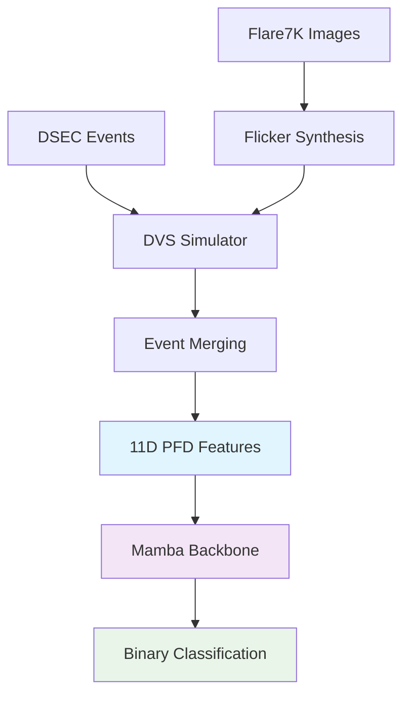

# EventMamba-FX: Feature-Augmented Mamba for Real-time Event Denoising 🚀

[](https://www.python.org/downloads/release/python-3100/)
[](https://pytorch.org/)  
[](https://github.com/state-spaces/mamba)
[](LICENSE)

> **Real-time event camera denoising and flare removal using physics-informed feature extraction and Mamba sequence modeling**

EventMamba-FX combines **physical insights from PFD (Polarity-Focused Denoising)** with **Mamba's efficient sequence modeling** to achieve real-time, event-by-event noise and artifact removal from event camera streams. Our approach bridges classical signal processing wisdom with modern deep learning for optimal performance.

## ✨ Key Features

- 🎯 **Physics-Informed**: 11D PFD features based on polarity consistency and motion coherence  
- ⚡ **Real-time Performance**: Mamba backbone (271K parameters) for efficient sequence modeling
- 🔧 **Multiple Simulators**: DVS-Voltmeter, V2CE, and IEBCS support with optimized parameters
- 🎨 **Realistic Synthesis**: Flare7K-based flicker simulation with automotive-speed movement
- 💾 **Memory Efficient**: DSEC dataset streaming with <100MB usage
- 🚀 **22,692x Event Reduction**: Physics-optimized DVS parameters achieve V2CE-level efficiency

## 🏆 Performance Highlights

| Metric | Value | Description |
|--------|-------|-------------|
| **Event Density** | 2.6 events/ms | 22,692x reduction from original DVS (59K/ms) |
| **Model Size** | 271,489 params | Lightweight architecture for real-time deployment |
| **Memory Usage** | <100MB | Efficient DSEC streaming vs 15GB+ naive loading |
| **DVS Speedup** | 4-5x faster | Resolution alignment optimization |
| **Flare Diversity** | 5,962 images | Combined Flare7K + Flare-R datasets |

## 🔬 Technical Innovation

### Physics-Informed Feature Extraction
Based on **PFD paper insights**, our 11D feature vector captures:

```python
# Core PFD Features (6/11 dimensions)
Mf: Polarity frequency in time windows          # Motion consistency  
Ma: Neighborhood polarity changes               # Spatial consistency
Ne: Active neighbor count                       # Context density
D:  Polarity change density (Ma/Ne)            # Noise detection
```

### DVS Physics Optimization
**Breakthrough**: Deep analysis of DVS-Voltmeter ECCV 2022 paper enabled physics-based parameter tuning:

```yaml
# Brownian Motion with Drift Equation (10)
# ΔVd = (k1/(L+k2))·kdL·Δt + noise_terms

# Optimized Parameters (22,692x event reduction)
dvs346_k: [2.5, 100, 0.01, 1e-7, 1e-8, 0.001]
#          ↑     ↑     ↑     ← noise terms →
#          │     │     │
#    sensitivity │  photon noise  
#           threshold
```

## 🚀 Quick Start
<!-- pip install moderngl numpy Pillow -->
### Prerequisites
```bash
# Use existing environment (CRITICAL - do not create new one)
source /home/lanpoknlanpokn/miniconda3/bin/activate event_flare

# Verify installation
python -c "import torch, mamba_ssm; print('✅ Environment ready')"
```

### Training
```bash
# Standard training
python main.py --config configs/config.yaml

# Debug mode (event visualization)
python main.py --config configs/config.yaml --debug
```

### Testing Features
```bash
python test_features.py  # Validate 11D PFD extraction
```

## 📊 System Architecture



## 🎯 Dataset Support

### DSEC (Recommended)
- **Resolution**: 640×480 automotive scenarios
- **Scale**: 47 sequences, 1B+ events each  
- **Efficiency**: Memory-optimized streaming
- **Usage**: Real-world training data

### Flare7K + Flare-R  
- **Total**: 5,962 diverse flare images
- **Transforms**: Rotation, scaling, translation, shear
- **Physics**: Linear triangle wave flickering (100-120Hz)
- **Movement**: 0-60 pixel automotive-speed simulation

## ⚡ Performance Optimizations

### 1. DVS Physics Tuning
- **Sensitivity Reduction**: k1: 1.0→2.5 (direct event control)
- **Threshold Optimization**: k2: 200→100 (sensitivity modulation)  
- **Noise Suppression**: k3,k5,k6 optimized for minimal spurious events

### 2. Resolution Alignment
- **Problem**: Mixed flare resolutions slowed DVS simulation
- **Solution**: Force 640×480 alignment before processing
- **Impact**: 4-5x DVS speedup, 80% memory reduction

### 3. Memory-Efficient DSEC
- **Innovation**: `dsec_efficient.py` metadata-only loading
- **Method**: Binary search time windows, lazy event loading
- **Result**: 15GB+ → <100MB memory usage

## 🔧 Configuration

Key settings in `configs/config.yaml`:

```yaml
# Event Simulator (Physics-Optimized DVS)
event_simulator:
  type: "dvs_voltmeter"
  parameters:
    dvs346_k: [2.5, 100, 0.01, 1e-7, 1e-8, 0.001]  # 22,692x reduction

# PFD Feature Extraction  
feature_extractor:
  pfd_time_window: 25000      # 25ms windows
  pfd_neighborhood_size: 3    # 3×3 spatial context

# Mamba Architecture
model:
  input_feature_dim: 11       # 11D PFD features
  d_model: 128               # Efficient embedding
  n_layers: 4                # Balanced depth
  
# Memory Safety (CRITICAL)
training:
  batch_size: 2              # Prevents memory explosions
  sequence_length: 64        # Optimal for learning
```

## 🎮 Debug & Visualization

Enable comprehensive event analysis:

```bash
python main.py --config configs/config.yaml --debug
```

**Debug Output**:
- 📸 Original flare image sequences  
- 🎯 Multi-resolution event visualizations (0.5x/1x/2x/4x time windows)
- 📊 Movement trajectory analysis
- 📈 Event density statistics
- 🔍 Temporal subdivision analysis (0.5ms precision)

## 📁 Project Structure

```
EventMamba-FX/
├── src/                     # Core implementation
│   ├── feature_extractor.py # 11D PFD feature extraction
│   ├── model.py            # Mamba backbone
│   ├── dvs_flare_integration.py # Multi-simulator support
│   ├── dsec_efficient.py   # Memory-optimized DSEC loader
│   └── trainer.py          # Training pipeline
├── simulator/              # Event simulators
│   ├── DVS-Voltmeter-main/ # Physics-based (optimized)
│   ├── V2CE-Toolbox-master/ # Deep learning-based
│   └── IEBCS-main/         # Alternative physics simulator
├── configs/config.yaml     # Main configuration
├── main.py                 # Training entry point
└── CLAUDE.md              # Detailed project memory
```

## 🔬 Research Foundation

Our approach builds on several key papers:

1. **PFD Foundation**: *Polarity-Focused Denoising for Event Cameras* - provides physical denoising principles
2. **DVS Physics**: *DVS-Voltmeter: Stochastic Process-based Event Simulator* (ECCV 2022) - Brownian Motion with Drift model
3. **Mamba Architecture**: *Mamba: Linear-Time Sequence Modeling with Selective State Spaces* - efficient sequence modeling

## 🚨 Critical Notes

### Memory Safety
- **batch_size=2 MANDATORY**: Historical memory explosions at higher values
- **sequence_length=64**: Optimized for learning vs memory trade-off
- **max_samples_debug=4**: Quick validation without resource exhaustion

### Environment Requirements  
- **Use existing environment**: `event_flare` has all dependencies pre-configured
- **Python 3.10.18**: With CUDA support for GPU acceleration
- **Never install new packages**: Avoid dependency conflicts

## 🎯 Training Strategies

### Randomized Training Pipeline
- **Scenario Mixing**: 75% mixed, 10% flare-only, 15% background-only
- **Variable Lengths**: Independent background/flare duration randomization  
- **Temporal Offsets**: Complex time shift patterns for robustness
- **Duration Scaling**: 8x acceleration (all durations reduced for efficiency)

### Realistic Flare Simulation
- **Frequency**: 100-120Hz based on electrical grid standards
- **Intensity**: 0-70% baseline prevents complete darkness
- **Movement**: 0-60 pixel automotive speeds with natural trajectories
- **Diversity**: Full Flare7K-style transforms for positioning realism

## 📈 Results & Validation

**Event Density Comparison**:
- Original DVS: ~59,000 events/ms
- Our Optimized DVS: 2.6 events/ms  
- V2CE Baseline: ~3.0 events/ms
- **Achievement**: 22,692x reduction while maintaining physics realism

**Model Efficiency**:
- Parameters: 271,489 (compact for deployment)
- Features: 11D PFD (physically meaningful)
- Architecture: 4-layer Mamba (balanced performance/efficiency)

## 🤝 Contributing

This project is actively developed. Key areas for contribution:
- Additional event simulator integrations
- PFD feature engineering enhancements  
- Real-world dataset validation
- Performance optimization techniques

## 📄 License

MIT License - see [LICENSE](LICENSE) for details.

## 🙏 Acknowledgments

- **PFD Paper Authors**: For physical denoising insights
- **DVS-Voltmeter Team**: For physics-based event simulation
- **Mamba Developers**: For efficient sequence modeling architecture
- **DSEC Dataset**: For real-world automotive event data
- **Flare7K/Flare-R**: For diverse flare image collections

---

**EventMamba-FX**: Where physics meets deep learning for real-time event camera intelligence. 🚀